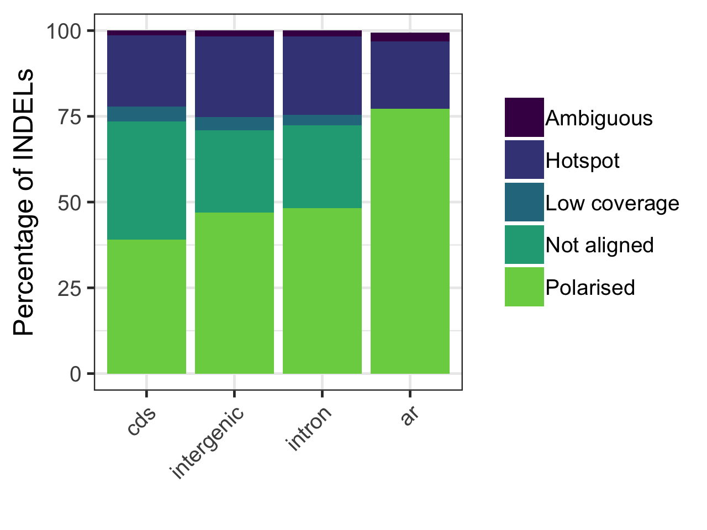

# Multispecies alignment and INDEL polarisation

## Alignment

### Genomes used

|Species           |Version           |Available from                                                        |
|:-----------------|:-----------------|:---------------------------------------------------------------------|
|zebra finch       |TaeGut3.2.4       |<ftp://ftp.ensembl.org/pub/release-84/fasta/taeniopygia_guttata/dna/> |
|great tit         |Parus_major1.0.4  |```/fastdata/bop15hjb/GT_ref/Parus_major_1.04.rename.fa```            |
|flycatcher        |FicAlb1.5         |<http://www.ncbi.nlm.nih.gov/genome/?term=flycatcher>                 |

### Preparing fasta files

All chromosomal fasta sequences were renamed to include species information (and converted from NCBI headers where applicable) as follows:

```
$ ~/rename_chromosomal_fasta_headers.py -fas_in ./
$ ls *rename.fa | while read i; do ~/fasta_add_header_prefix.py -fa $i -pre 'Flycatcher.chr'; done
$ ls *fa | cut -d '.' -f 1-6 | while read i; do mv $i.rename.fa $i.fa ; done
$ ls *fa | while read i; do ~/fasta_add_header_prefix.py -fa $i -pre 'Greattit.'; done
$ ls *fa | while read i; do ~/fasta_add_header_prefix.py -fa $i -pre 'Zebrafinch.chr'; done
```

Next list files (tab delim) were generated that contained chromosomal fasta paths and sequence nicknames for use by lastz with the following script:

```
$ ./make_chromo_list.py -dir /fastdata/bop15hjb/bird_alignments/UCSC_pipeline/genomes/Greattit/renamed_headers/ -spp Greattit
$ ./make_chromo_list.py -dir /fastdata/bop15hjb/bird_alignments/UCSC_pipeline/genomes/Zebrafinch/renamed_headers/ -spp Zebrafinch
$ ./make_chromo_list.py -dir /fastdata/bop15hjb/bird_alignments/UCSC_pipeline/genomes/Flycatcher/renamed_headers/ -spp Flycatcher
```

### Pairwise alignments

LastZ was used to generate chromosomal pairwise alignments between the zebrafinch  and each of the query species. This used a python wrapper script as follows, which encorporates alignment, chaining and netting with lastz, axtChain and ChainNet respectively:

```
$ ./chromosomal_lastz_chain_net.py -target_list /fastdata/bop15hjb/bird_alignments/UCSC_pipeline/fasta_lists/Zebrafinch.chromosome.list -query_list /fastdata/bop15hjb/bird_alignments/UCSC_pipeline/fasta_lists/Greattit.chromosome.list -out /fastdata/bop15hjb/bird_alignments/UCSC_pipeline/pairwise_zhang_param/Zebrafinch_Greattit/
$ ./chromosomal_lastz_chain_net.py -target_list /fastdata/bop15hjb/bird_alignments/UCSC_pipeline/fasta_lists/Zebrafinch.chromosome.list -query_list /fastdata/bop15hjb/bird_alignments/UCSC_pipeline/fasta_lists/Flycatcher.chromosome.list -out /fastdata/bop15hjb/bird_alignments/UCSC_pipeline/pairwise_zhang_param/Zebrafinch_Flycatcher/ -evolgen
```

Chromosomal mafs were then concatenated to form a whole genome maf as follows:

```
$ ~/merge_mafs.py -dir ./ -out_maf ../whole_genome_pairwise_mafs/Zebrafinch_ref/Zebrafinch.Greattit.maf
$ ~/merge_mafs.py -dir ./ -out_maf ../whole_genome_pairwise_mafs/Zebrafinch_ref/Zebrafinch.Flycatcher.maf
```

### Multiple alignment

Single coverage of the reference genome was then ensured using 'single_cov2' to satisfy multiz as follows:

```
$ ./single_cov.py -dir /fastdata/bop15hjb/bird_alignments/UCSC_pipeline/pairwise_zhang_param/whole_genome_pairwise_mafs/Zebrafinch_ref/ -ref_name Zebrafinch -evolgen
```

Multiple alignment was run with 'multiz' using the 'roast' wrapper in the python script ```roast_birds.py``` as follows:

```
$ ./roast_birds.py -maf_dir /fastdata/bop15hjb/bird_alignments/UCSC_pipeline/pairwise_zhang_param/whole_genome_pairwise_mafs/Zebrafinch_ref/zf_fc_gt_single_coverage/ -ref Zebrafinch -tree "'((Zebrafinch Flycatcher) Greattit)'" -out /fastdata/bop15hjb/bird_alignments/UCSC_pipeline/multiple_zhang_param/Zebrafinch.Flycatcher.Greattit.maf -evolgen
```

The resulting maf file was then converted to a whole genome alignment bed files (one for each species) as follows:

```
$ ~/parus_indel/alignment_and_polarisation/automate_maf_to_bed.py -maf /fastdata/bop15hjb/bird_alignments/gbgc_proj/Zebrafinch.Flycatcher.Greattit.maf.gz -ref_sp Greattit -ref_fa /fastdata/bop15hjb/GT_ref/Parus_major_1.04.rename.fa -out_pre /fastdata/bop15hjb/bird_alignments/gbgc_proj/Greattit.Zebrafinch.Flycatcher -evolgen
$ cd /fastdata/bop15hjb/bird_alignments/gbgc_proj/
$ tabix -pbed Greattit.Zebrafinch.Flycatcher.wga.bed.gz
$ cp Greattit.Zebrafinch.Flycatcher.wga.bed.gz* /fastdata/bop15hjb/GT_ref/
```

## Getting ancestral repeats using the WGA

Ancestral LINEs coordinates were obtained for the great tit genome using the mutlispecies alignment. Firstly the repeat masker output files were obtained for great tit and zebra finch, and the masking coordinates for the flycatcher were downloaded from <ftp://ftp.ncbi.nlm.nih.gov/genomes/Ficedula_albicollis/masking_coordinates.gz>. LINE coordinates were then extracted from these files as follows.

For great tit and zebra finch:

```
zgrep LINE GCF_001522545.1_Parus_major1.0.3_rm.out.gz | cut -d '.' -f 4- | cut -d ' ' -f 3- | cut -d '(' -f 1 | bgzip -c > GCF_001522545.1_Parus_major1.0.3_rm.out.LINEs.bed.gz
zgrep LINE Taeniopygia_guttata.RepeatMasker.out.gz | cut -d '.' -f 4- | cut -d ' ' -f 3- | cut -d '(' -f 1 | while read i; do echo chr$i; done | bgzip -c > Taeniopygia_guttata.RepeatMasker.out.LINEs.rename.bed.gz
```

For flycatcher LINEs were extracted using a list of LINE repeat types found in zebrafinch and great tit:

```
zcat FC_masking_coordinates.gz | maskingcoord2LINEcoord.py -LINE_type ZF_GT_LINE_types.txt | bgzip -c > FicAlb1.5.masking_coordinates.LINEs.bed.gz
```

Flycatcher and great tit chromosomes were then renamed to format ```chrXX``` from NCBI ref-seq IDs as follows:

```
grep -v ^Loc FC_replicon_info.csv | cut -d ',' -f 3-4 | grep NC | sed 's:,:       :g' | while read i; do echo chr$i; done > FicAlb1.5.chromosome_IDs.txt 
zcat FicAlb1.5.masking_coordinates.LINEs.bed.gz | rename_bedchromsomes.py -chr_IDs FicAlb1.5.chromosome_IDs.txt | bgzip -c > FicAlb1.5.masking_coordinates.LINEs.rename.bed.gz 
```

```
zcat /fastdata/bop15hjb/GT_ref/GCF_001522545.1_Parus_major1.0.3_genomic.gff.gz | GFF2chromoIDs.py | grep NC > GCF_001522545.1_Parus_major1.0.3_chromosome_IDs.txt
zcat GCF_001522545.1_Parus_major1.0.3_rm.out.LINEs.bed.gz | rename_bedchromsomes.py -chr_IDs GCF_001522545.1_Parus_major1.0.3_chromosome_IDs.txt | bgzip -c > GCF_001522545.1_Parus_major1.0.3_rm.out.LINEs.rename.bed.gz 
```

The overlap of all three files was then taken using the whole genome alignment as follows (note this script wraps some utilities from <https://github.com/padraicc/WGAbed>):

```
~/parus_indel/alignment_and_polarisation/get_conserved_LINEs.py -wga_bed /fastdata/bop15hjb/bird_alignments/gbgc_proj/Greattit.Zebrafinch.Flycatcher.wga.bed.gz -r_bed /fastdata/bop15hjb/GT_data/BGI_BWA_GATK/divergence_data/repeat_coordinates/GCF_001522545.1_Parus_major1.0.3_rm.out.LINEs.rename.bed.gz -q_bed Zebrafinch,/fastdata/bop15hjb/GT_data/BGI_BWA_GATK/divergence_data/repeat_coordinates/Taeniopygia_guttata.RepeatMasker.out.LINEs.rename.tab.sorted.bed.gz -q_bed Flycatcher,/fastdata/bop15hjb/GT_data/BGI_BWA_GATK/divergence_data/repeat_coordinates/FicAlb1.5.masking_coordinates.LINEs.rename.bed.gz -chr_list /fastdata/bop15hjb/GT_ref/chromosome_list.bed -out /fastdata/bop15hjb/GT_data/BGI_BWA_GATK/divergence_data/repeat_coordinates/LINE_intersect/Greattit.Zebrafinch.Flycatcher -evolgen
cd /fastdata/bop15hjb/GT_data/BGI_BWA_GATK/divergence_data/repeat_coordinates/LINE_intersect/
zcat Greattit.Zebrafinch.Flycatcher.LINEs.wga.bed.gz | sort -k1,1 -k2,2n | bgzip -c > Greattit.Zebrafinch.Flycatcher.LINEs.sorted.wga.bed.gz
zcat Greattit.Zebrafinch.Flycatcher.LINEs.sorted.wga.bed.gz | cut -f 1-3 | bedtools merge -i stdin | bgzip -c > Greattit.Zebrafinch.Flycatcher.ancLINEs.sorted.bed.gz
cp Greattit.Zebrafinch.Flycatcher.ancLINEs.sorted.bed.gz* /fastdata/bop15hjb/GT_ref/
```

## INDEL polarisation

Firstly the sequence alignments across species [in addition to 1bp up and down stream of INDEL] for each INDEL in the dataset were pulled out of the multiple alignment file with the following script:

```
~/VARfromMAF.py -vcf /fastdata/bop15hjb/GT_data/BGI_BWA_GATK/Analysis_ready_data/bgi_10birds.raw.snps.indels.all_sites.rawindels.recalibrated.filtered_t99.0.pass.maxlength50.biallelic.coveragefiltered.pass.repeatfilter.pass.vcf -maf /fastdata/bop15hjb/bird_alignments/UCSC_pipeline/multiple_zhang_param/Zebrafinch.Flycatcher.Greattit.maf  -target_spp Greattit -out /fastdata/bop15hjb/GT_data/BGI_BWA_GATK/Polarisation/ -no_jobs 100
```

Secondly the output of the above script was used to annotate the ancestral state for each variant in the INDEL vcf as follows:

```
~/polarise_vcf_indels.py -vcf ../Analysis_ready_data/bgi_10birds.raw.snps.indels.all_sites.rawindels.recalibrated.filtered_t99.0.pass.maxlength50.biallelic.coveragefiltered.pass.repeatfilter.pass.vcf -align_data all_indels.alignment_states.txt -target_spp Greattit
```

|                 |           |
|:----------------|:---------:|  
|Total no INDELs  | 1240366   |
|INDELs polarised | 593030    |
|Hotspots         | 287659    |
|Low spp coverage | 42732     |
|Ambiguous        | 21464     |
|Not in alignment | 295481    |
|Total unpolarised| 647336    |

## SNP polarisation

Firstly the sequence alignments across species for each SNP in the dataset were pulled out of the multiple alignment file with the following script:

```
./VARfromMAF.py  -vcf /fastdata/bop15hjb/GT_data/BGI_BWA_GATK/SNP_data/gt_10birds_recalibrated_snps_only_99pass.maxlength50.biallelic.coveragefiltered.pass.repeatfilter.pass.vcf -maf /fastdata/bop15hjb/bird_alignments/UCSC_pipeline/multiple_zhang_param/Zebrafinch.Flycatcher.Greattit.maf -target_spp Greattit -out /fastdata/bop15hjb/GT_data/BGI_BWA_GATK/SNP_data/polarisation/ -no_jobs 500
```

Secondly the output of the above script was used to annotate the ancestral state for each variant in the INDEL vcf as follows:

```
./polarise_vcf_snps.py -vcf /fastdata/bop15hjb/GT_data/BGI_BWA_GATK/SNP_data/gt_10birds_recalibrated_snps_only_99pass.maxlength50.biallelic.coveragefiltered.pass.repeatfilter.pass.vcf -align_data /fastdata/bop15hjb/GT_data/BGI_BWA_GATK/SNP_data/polarisation/all_variants.alignment_states.txt -target_spp Greattit -sub
```

|Category         | Number of SNPs |
|:----------------|:--------------:|
|Total no SNPs    | 10772087       |
|SNPs polarised   | 4430706        |
|Low spp coverage | 446296         |
|Ambiguous        | 2399524        |
|Not in alignment | 2515988        |
|Total unpolarised| 6341381        |


## INDEL polarisation by region summary 

INDEL polarisation success was compared across different regions. Note that as ancestral repeats were identified from
the whole genome alignent the categories 'Not aligned' and 'Low coverage' do not apply as such regions of the alignment 
would be unable to be identified as ancestral repeat in our pipeline. Therefore to roughly compare ancestral repeats
with other regions we scaled the results by assuming that a similar number of INDELs were not aligned in ancestral 
repeat regions as non-coding regions (~24% of INDELs).

```bash
mkdir /fastdata/bop15hjb/h_j_b/GT_data/BGI_BWA_GATK/Polarisation/indel_pol_summary

./indel_pol_summary.py -vcf /fastdata/bop15hjb/h_j_b/GT_data/BGI_BWA_GATK/Analysis_ready_data/final/bgi_10birds.filtered_indels.pol.anno.recomb.line.vcf.gz -align_states /fastdata/bop15hjb/h_j_b/GT_data/BGI_BWA_GATK/Polarisation/all_indels.alignment_states.txt -out_dir /fastdata/bop15hjb/h_j_b/GT_data/BGI_BWA_GATK/Polarisation/indel_pol_summary/ > polarisation_summary_indels_nonrep.csv
./indel_pol_summary.py -vcf /fastdata/bop15hjb/h_j_b/GT_data/BGI_BWA_GATK/divergence_data/polymorphic_non_repeat_filtered_vcfs/bgi_10birds.raw.snps.indels.all_sites.rawindels.recalibrated.filtered_t99.0.pass.maxlength50.biallelic.coveragefiltered.pass.LINEintersect.polarised.vcf.gz -align_states /fastdata/bop15hjb/h_j_b/GT_data/BGI_BWA_GATK/divergence_data/polymorphic_non_repeat_filtered_vcfs/all_variants.alignment_states.txt -out_dir /fastdata/bop15hjb/h_j_b/GT_data/BGI_BWA_GATK/Polarisation/indel_pol_summary/ -bed_list ar_bed.txt > polarisation_summary_indels_ar.csv

Rscript pol_sum_indel.R
```

{:height="100%" width="100%"}