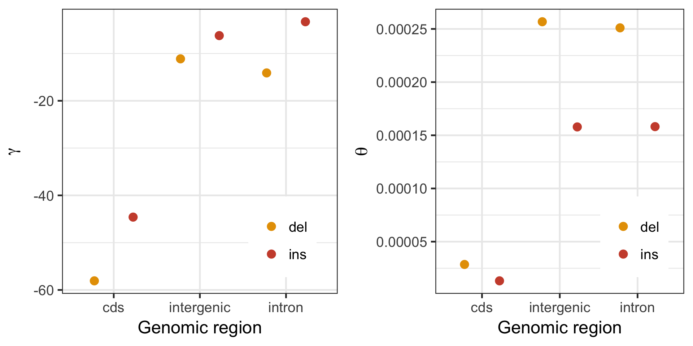
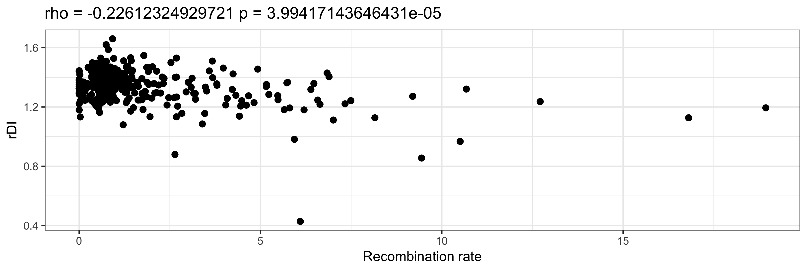
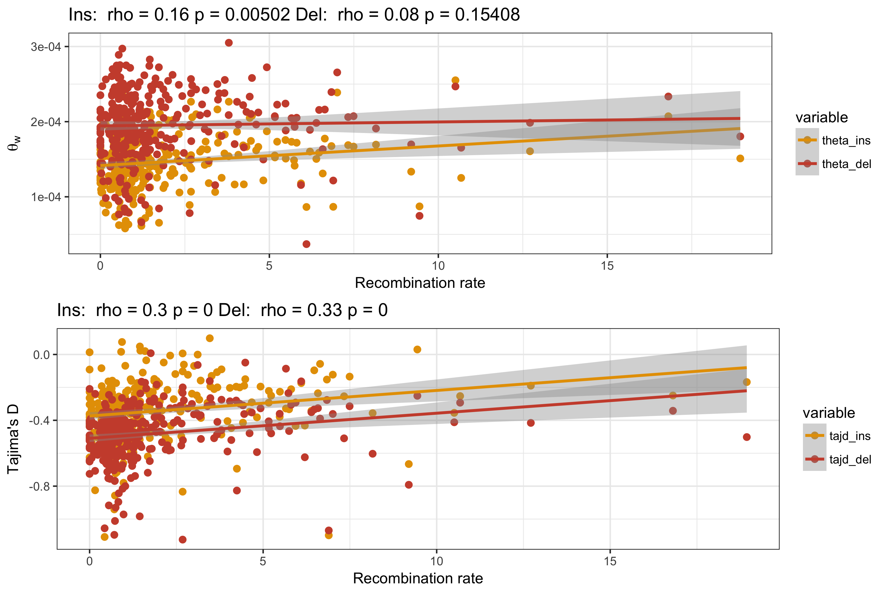
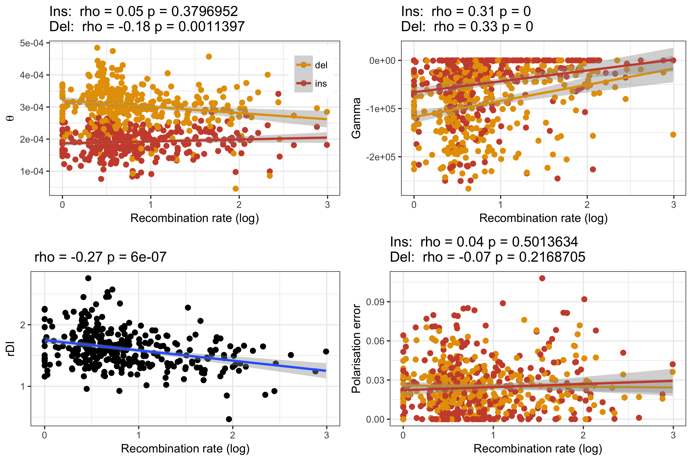

# Analyses and results from applying anavar the INDEL data

Scripts use to run anavar make use of the python module ```anavar_utils``` available at: <https://github.com/henryjuho/anavar_utils>.

## identifying the best fitting model in anavar for CDS and non-coding data

Firstly four different anavar models (1 class, 2 class, 3 class and continuous) were run on INDEL data from coding regions (CDS) with INDELs in ancestral repeats as neutral reference. These were all run as both full models and reduced models where mutation rates were equal between neutral and selected variants.

```
$ ~/parus_indel/anavar_analyses/sel_vs_neu_anavar.py -mode indel -vcf /fastdata/bop15hjb/GT_data/BGI_BWA_GATK/Analysis_ready_data/final/bgi_10birds.filtered_indels.pol.anno.recomb.line.vcf.gz -n 20 -call_csv /fastdata/bop15hjb/GT_ref/gt_callable_summary.csv -c 1 -dfe discrete -n_search 100 -split 50 -out_pre /fastdata/bop15hjb/GT_data/BGI_BWA_GATK/anavar_analysis/cds_vs_ar/gt_cds_ar_ref_1class -evolgen
$ ~/parus_indel/anavar_analyses/sel_vs_neu_anavar.py -mode indel -vcf /fastdata/bop15hjb/GT_data/BGI_BWA_GATK/Analysis_ready_data/final/bgi_10birds.filtered_indels.pol.anno.recomb.line.vcf.gz -n 20 -call_csv /fastdata/bop15hjb/GT_ref/gt_callable_summary.csv -c 1 -dfe discrete -n_search 100 -split 50 -out_pre /fastdata/bop15hjb/GT_data/BGI_BWA_GATK/anavar_analysis/cds_vs_ar/gt_cds_ar_ref_1class_equal_t -constraint equal_mutation_rate -evolgen

$ ~/parus_indel/anavar_analyses/sel_vs_neu_anavar.py -mode indel -vcf /fastdata/bop15hjb/GT_data/BGI_BWA_GATK/Analysis_ready_data/final/bgi_10birds.filtered_indels.pol.anno.recomb.line.vcf.gz -n 20 -call_csv /fastdata/bop15hjb/GT_ref/gt_callable_summary.csv -c 2 -dfe discrete -n_search 100 -split 50 -out_pre /fastdata/bop15hjb/GT_data/BGI_BWA_GATK/anavar_analysis/cds_vs_ar/gt_cds_ar_ref_2class -evolgen
$ ~/parus_indel/anavar_analyses/sel_vs_neu_anavar.py -mode indel -vcf /fastdata/bop15hjb/GT_data/BGI_BWA_GATK/Analysis_ready_data/final/bgi_10birds.filtered_indels.pol.anno.recomb.line.vcf.gz -n 20 -call_csv /fastdata/bop15hjb/GT_ref/gt_callable_summary.csv -c 2 -dfe discrete -out_pre /fastdata/bop15hjb/GT_data/BGI_BWA_GATK/anavar_analysis/cds_vs_ar/gt_cds_ar_ref_2class_equal_t -constraint equal_mutation_rate -evolgen -n_search 25 -split 200 -alg NLOPT_LN_NELDERMEAD -nnoimp 100 -maximp 1000

$ ~/parus_indel/anavar_analyses/sel_vs_neu_anavar.py -mode indel -vcf /fastdata/bop15hjb/GT_data/BGI_BWA_GATK/Analysis_ready_data/final/bgi_10birds.filtered_indels.pol.anno.recomb.line.vcf.gz -n 20 -call_csv /fastdata/bop15hjb/GT_ref/gt_callable_summary.csv -c 3 -dfe discrete -n_search 100 -split 100 -out_pre /fastdata/bop15hjb/GT_data/BGI_BWA_GATK/anavar_analysis/cds_vs_ar/gt_cds_ar_ref_3class -evolgen
$ ~/parus_indel/anavar_analyses/sel_vs_neu_anavar.py -mode indel -vcf /fastdata/bop15hjb/GT_data/BGI_BWA_GATK/Analysis_ready_data/final/bgi_10birds.filtered_indels.pol.anno.recomb.line.vcf.gz -n 20 -call_csv /fastdata/bop15hjb/GT_ref/gt_callable_summary.csv -c 3 -dfe discrete -out_pre /fastdata/bop15hjb/GT_data/BGI_BWA_GATK/anavar_analysis/cds_vs_ar/gt_cds_ar_ref_3class_equal_t -constraint equal_mutation_rate -n_search 25 -split 200 -alg NLOPT_LN_NELDERMEAD -nnoimp 100 -maximp 1000

$ ~/parus_indel/anavar_analyses/sel_vs_neu_anavar.py -mode indel -vcf /fastdata/bop15hjb/GT_data/BGI_BWA_GATK/Analysis_ready_data/final/bgi_10birds.filtered_indels.pol.anno.recomb.line.vcf.gz -n 20 -call_csv /fastdata/bop15hjb/GT_ref/gt_callable_summary.csv -c 1 -dfe continuous -degree 500 -n_search 20 -split 250 -out_pre /fastdata/bop15hjb/GT_data/BGI_BWA_GATK/anavar_analysis/cds_vs_ar/gt_cds_ar_ref_continuous -evolgen
$ ~/parus_indel/anavar_analyses/sel_vs_neu_anavar.py -mode indel -vcf /fastdata/bop15hjb/GT_data/BGI_BWA_GATK/Analysis_ready_data/final/bgi_10birds.filtered_indels.pol.anno.recomb.line.vcf.gz -n 20 -call_csv /fastdata/bop15hjb/GT_ref/gt_callable_summary.csv -c 1 -dfe continuous -degree 500 -n_search 20 -split 250 -out_pre /fastdata/bop15hjb/GT_data/BGI_BWA_GATK/anavar_analysis/cds_vs_ar/gt_cds_ar_ref_continuous_equal_t -constraint equal_mutation_rate -evolgen
```

Secondly this process was repeated to determine the best model for the non-coding data.

```
$ ~/parus_indel/anavar_analyses/sel_vs_neu_anavar.py -mode indel -vcf /fastdata/bop15hjb/GT_data/BGI_BWA_GATK/Analysis_ready_data/final/bgi_10birds.filtered_indels.pol.anno.recomb.line.vcf.gz -n 20 -call_csv /fastdata/bop15hjb/GT_ref/gt_callable_summary.csv -c 1 -dfe discrete -n_search 100 -split 50 -out_pre /fastdata/bop15hjb/GT_data/BGI_BWA_GATK/anavar_analysis/non-coding_vs_ar/gt_non-coding_ar_ref_1class -evolgen -sel_type non-coding
$ ~/parus_indel/anavar_analyses/sel_vs_neu_anavar.py -mode indel -vcf /fastdata/bop15hjb/GT_data/BGI_BWA_GATK/Analysis_ready_data/final/bgi_10birds.filtered_indels.pol.anno.recomb.line.vcf.gz -n 20 -call_csv /fastdata/bop15hjb/GT_ref/gt_callable_summary.csv -c 1 -dfe discrete -n_search 100 -split 50 -out_pre /fastdata/bop15hjb/GT_data/BGI_BWA_GATK/anavar_analysis/non-coding_vs_ar/gt_non-coding_ar_ref_1class_equal_t -constraint equal_mutation_rate -evolgen -sel_type non-coding

$ ~/parus_indel/anavar_analyses/sel_vs_neu_anavar.py -mode indel -vcf /fastdata/bop15hjb/GT_data/BGI_BWA_GATK/Analysis_ready_data/final/bgi_10birds.filtered_indels.pol.anno.recomb.line.vcf.gz -n 20 -call_csv /fastdata/bop15hjb/GT_ref/gt_callable_summary.csv -c 2 -dfe discrete -out_pre /fastdata/bop15hjb/GT_data/BGI_BWA_GATK/anavar_analysis/non-coding_vs_ar/gt_non-coding_ar_ref_2class -sel_type non-coding  -n_search 25 -split 200 -alg NLOPT_LN_NELDERMEAD -nnoimp 100 -maximp 1000
$ ~/parus_indel/anavar_analyses/sel_vs_neu_anavar.py -mode indel -vcf /fastdata/bop15hjb/GT_data/BGI_BWA_GATK/Analysis_ready_data/final/bgi_10birds.filtered_indels.pol.anno.recomb.line.vcf.gz -n 20 -call_csv /fastdata/bop15hjb/GT_ref/gt_callable_summary.csv -c 2 -dfe discrete -n_search 100 -split 50 -out_pre /fastdata/bop15hjb/GT_data/BGI_BWA_GATK/anavar_analysis/non-coding_vs_ar/gt_non-coding_ar_ref_2class_equal_t -constraint equal_mutation_rate -evolgen -sel_type non-coding

$ ~/parus_indel/anavar_analyses/sel_vs_neu_anavar.py -mode indel -vcf /fastdata/bop15hjb/GT_data/BGI_BWA_GATK/Analysis_ready_data/final/bgi_10birds.filtered_indels.pol.anno.recomb.line.vcf.gz -n 20 -call_csv /fastdata/bop15hjb/GT_ref/gt_callable_summary.csv -c 3 -dfe discrete -out_pre /fastdata/bop15hjb/GT_data/BGI_BWA_GATK/anavar_analysis/non-coding_vs_ar/gt_non-coding_ar_ref_3class -sel_type non-coding -n_search 25 -split 200 -alg NLOPT_LN_NELDERMEAD -nnoimp 100 -maximp 1000
$ ~/parus_indel/anavar_analyses/sel_vs_neu_anavar.py -mode indel -vcf /fastdata/bop15hjb/GT_data/BGI_BWA_GATK/Analysis_ready_data/final/bgi_10birds.filtered_indels.pol.anno.recomb.line.vcf.gz -n 20 -call_csv /fastdata/bop15hjb/GT_ref/gt_callable_summary.csv -c 3 -dfe discrete -n_search 100 -split 100 -out_pre /fastdata/bop15hjb/GT_data/BGI_BWA_GATK/anavar_analysis/non-coding_vs_ar/gt_non-coding_ar_ref_3class_equal_t -constraint equal_mutation_rate -sel_type non-coding

$ ~/parus_indel/anavar_analyses/sel_vs_neu_anavar.py -mode indel -vcf /fastdata/bop15hjb/GT_data/BGI_BWA_GATK/Analysis_ready_data/final/bgi_10birds.filtered_indels.pol.anno.recomb.line.vcf.gz -n 20 -call_csv /fastdata/bop15hjb/GT_ref/gt_callable_summary.csv -c 1 -dfe continuous -degree 500 -n_search 20 -split 250 -out_pre /fastdata/bop15hjb/GT_data/BGI_BWA_GATK/anavar_analysis/non-coding_vs_ar/gt_non-coding_ar_ref_continuous -evolgen -sel_type non-coding
$ ~/parus_indel/anavar_analyses/sel_vs_neu_anavar.py -mode indel -vcf /fastdata/bop15hjb/GT_data/BGI_BWA_GATK/Analysis_ready_data/final/bgi_10birds.filtered_indels.pol.anno.recomb.line.vcf.gz -n 20 -call_csv /fastdata/bop15hjb/GT_ref/gt_callable_summary.csv -c 1 -dfe continuous -degree 500 -n_search 20 -split 250 -out_pre /fastdata/bop15hjb/GT_data/BGI_BWA_GATK/anavar_analysis/non-coding_vs_ar/gt_non-coding_ar_ref_continuous_equal_t -constraint equal_mutation_rate -evolgen -sel_type non-coding
```

The results were gathered:

```
$ cd /home/bop15hjb/parus_indel/anavar_analyses

# all models
$ ls /fastdata/bop15hjb/GT_data/BGI_BWA_GATK/anavar_analysis/cds_vs_ar/*merged* | ./process_anavar_results.py > gt_cds_v_ar_anavar_results_indels.aic.csv
$ ls /fastdata/bop15hjb/GT_data/BGI_BWA_GATK/anavar_analysis/non-coding_vs_ar/*merged* | ./process_anavar_results.py > gt_non-coding_v_ar_anavar_results_indels.aic.csv

# equal mutation rate models
$ ls /fastdata/bop15hjb/GT_data/BGI_BWA_GATK/anavar_analysis/cds_vs_ar/*equal_t*merged* | ./process_anavar_results.py > gt_cds_v_ar_indels_equal_t.aic.csv
$ ls /fastdata/bop15hjb/GT_data/BGI_BWA_GATK/anavar_analysis/non-coding_vs_ar/*equal_t*merged* | ./process_anavar_results.py > gt_non-coding_v_ar_indels_equal_t.aic.csv
```

CDS results can be found [here](gt_cds_v_ar_anavar_results_indels.aic.csv) and non-coding [here](gt_non-coding_v_ar_anavar_results_indels.aic.csv).

## Regional anavar with neutral reference

After identifying the best fitting model as the continuous gamma model, we fit this model to different genomic regions, including intergenic, intronic and CDS.

```
$ ~/parus_indel/anavar_analyses/sel_vs_neu_anavar.py -mode indel -vcf /fastdata/bop15hjb/GT_data/BGI_BWA_GATK/Analysis_ready_data/final/bgi_10birds.filtered_indels.pol.anno.recomb.line.vcf.gz -n 20 -call_csv /fastdata/bop15hjb/GT_ref/gt_callable_summary.csv -c 1 -dfe continuous -n_search 100 -split 50 -out_pre /fastdata/bop15hjb/GT_data/BGI_BWA_GATK/anavar_analysis/regional/gt_sel_neu_ref_continuous_regioncds -sel_type CDS
$ ~/parus_indel/anavar_analyses/sel_vs_neu_anavar.py -mode indel -vcf /fastdata/bop15hjb/GT_data/BGI_BWA_GATK/Analysis_ready_data/final/bgi_10birds.filtered_indels.pol.anno.recomb.line.vcf.gz -n 20 -call_csv /fastdata/bop15hjb/GT_ref/gt_callable_summary.csv -c 1 -dfe continuous -n_search 100 -split 50 -out_pre /fastdata/bop15hjb/GT_data/BGI_BWA_GATK/anavar_analysis/regional/gt_sel_neu_ref_continuous_regionintergenic -sel_type intergenic
$ ~/parus_indel/anavar_analyses/sel_vs_neu_anavar.py -mode indel -vcf /fastdata/bop15hjb/GT_data/BGI_BWA_GATK/Analysis_ready_data/final/bgi_10birds.filtered_indels.pol.anno.recomb.line.vcf.gz -n 20 -call_csv /fastdata/bop15hjb/GT_ref/gt_callable_summary.csv -c 1 -dfe continuous -n_search 100 -split 50 -out_pre /fastdata/bop15hjb/GT_data/BGI_BWA_GATK/anavar_analysis/regional/gt_sel_neu_ref_continuous_regionintron -sel_type intron
```

The results were gathered and plotted:

```
$ cd ~/parus_indel/anavar_analyses/
$ ls ~/sharc_fastdata/GT_data/BGI_BWA_GATK/anavar_analysis/regional/*merged* | ./process_anavar_results.py -file_pattern region,_region\(\\w+\)\\. | cut -f 1-18 -d ',' > gt_regional_anavar_results.csv
$ Rscript regional_anavar.R 
```



## Recombination window analysis

2Mb window coordinates were generated and mean recombination rates were calculated per window using scripts from the biased gene conversion project. Windows without recombination rate estimates and with less than 500 polarisable INDELs were excluded.

```
$ qsub prepare_windows.sh
$ cd ~/parus_indel/anavar_analyses
$ python consolidate_window_info.py > all_2Mb_windows.txt
$ python filter_windows.py
$ ./add_window_indel_subs.py -windows filtered_2Mb_windows.txt -wga_bed /fastdata/bop15hjb/bird_alignments/UCSC_pipeline/multiple_zhang_param/Zebrafinch.Flycatcher.Greattit.wga.bed.gz > filtered_2Mb_windows_with_subs.txt
```

The relationship between recombination rate and the ratio of deletions to insertions (rDI) was tested and plotted:

```
$ Rscript window_rdi.R
```



Additionally the relationship between theta and recombination rate and Tajima's D and recombination was explored for both insertions and deletions.

```
$ Rscript window_summary.R
```



Anavar was then run on each window, with a continuous gamma model (both the full model and the reduced, equal theta model) and a discrete 1 class gamma model:

```
$ ~/parus_indel/anavar_analyses/window_sel_vs_neu_anavar.py -vcf /fastdata/bop15hjb/GT_data/BGI_BWA_GATK/Analysis_ready_data/final/bgi_10birds.filtered_indels.pol.anno.recomb.line.vcf.gz -windows ~/parus_indel/anavar_analyses/filtered_2Mb_windows.txt -call_fa /fastdata/bop15hjb/GT_data/BGI_BWA_GATK/Callable_sites/bgi_10birds.callable.fa -noncoding_bed /fastdata/bop15hjb/GT_ref/gt_noncoding.bed.gz -out_pre /fastdata/bop15hjb/GT_data/BGI_BWA_GATK/anavar_analysis/window_analysis/gt_window_anavar -evolgen
$ ~/parus_indel/anavar_analyses/window_sel_vs_neu_anavar.py -vcf /fastdata/bop15hjb/GT_data/BGI_BWA_GATK/Analysis_ready_data/final/bgi_10birds.filtered_indels.pol.anno.recomb.line.vcf.gz -windows ~/parus_indel/anavar_analyses/filtered_2Mb_windows.txt -call_fa /fastdata/bop15hjb/GT_data/BGI_BWA_GATK/Callable_sites/bgi_10birds.callable.fa -noncoding_bed /fastdata/bop15hjb/GT_ref/gt_noncoding.bed.gz -out_pre /fastdata/bop15hjb/GT_data/BGI_BWA_GATK/anavar_analysis/window_analysis_equal_t/gt_window_anavar_equal_t -equal_theta -evolgen
$ ~/parus_indel/anavar_analyses/window_sel_vs_neu_anavar.py -vcf /fastdata/bop15hjb/GT_data/BGI_BWA_GATK/Analysis_ready_data/final/bgi_10birds.filtered_indels.pol.anno.recomb.line.vcf.gz -windows ~/parus_indel/anavar_analyses/filtered_2Mb_windows.txt -call_fa /fastdata/bop15hjb/GT_data/BGI_BWA_GATK/Callable_sites/bgi_10birds.callable.fa -noncoding_bed /fastdata/bop15hjb/GT_ref/gt_noncoding.bed.gz -out_pre /fastdata/bop15hjb/GT_data/BGI_BWA_GATK/anavar_analysis/window_analysis_discrete/gt_window_anavar_discrete -evolgen -dfe discrete
$ cd ~/parus_indel/anavar_analyses
$ ls /fastdata/bop15hjb/GT_data/BGI_BWA_GATK/anavar_analysis/window_analysis/*results.txt | ./process_anavar_results.py -file_pattern window,_window\(\\d+\)\\. | cut -d ',' -f 1-18 > gt_windows_noncoding_continuous_full_results.csv
$ ls /fastdata/bop15hjb/GT_data/BGI_BWA_GATK/anavar_analysis/window_analysis_discrete/*results.txt | ./process_anavar_results.py -file_pattern window,_window\(\\d+\)\\. | cut -d ',' -f 1-18 > gt_windows_noncoding_discrete_full_results.csv 
# removed empty results file
$ rm /fastdata/bop15hjb/GT_data/BGI_BWA_GATK/anavar_analysis/window_analysis_equal_t/gt_window_anavar_equal_t_window179.results.txt
$ ls /fastdata/bop15hjb/GT_data/BGI_BWA_GATK/anavar_analysis/window_analysis_equal_t/*results.txt | ./process_anavar_results.py -file_pattern window,_window\(\\d+\)\\. | cut -d ',' -f 1-18 > gt_windows_noncoding_continuous_equal_t_results.csv
$ ./compile_recomb_window_res.py -results gt_windows_noncoding_continuous_full_results.csv -windows filtered_2Mb_windows.txt > gt_windows_noncoding_continuous_full_results.windowdata.csv
$ ./compile_recomb_window_res.py -results gt_windows_noncoding_discrete_full_results.csv -windows filtered_2Mb_windows.txt > gt_windows_noncoding_discrete_full_results.windowdata.csv
$ ./compile_recomb_window_res.py -results gt_windows_noncoding_continuous_equal_t_results.csv -windows filtered_2Mb_windows.txt > gt_windows_noncoding_continuous_equal_t_results.windowdata.csv
$ Rscript window_anavar.R
$ Rscript window_anavar_discrete.R
$ Rscript window_anavar_equal_t.R 
```




Reduced model results [here](continuous_window_anavar_equal_t.png).
Discrete model results [here](discrete_window_anavar.png).
