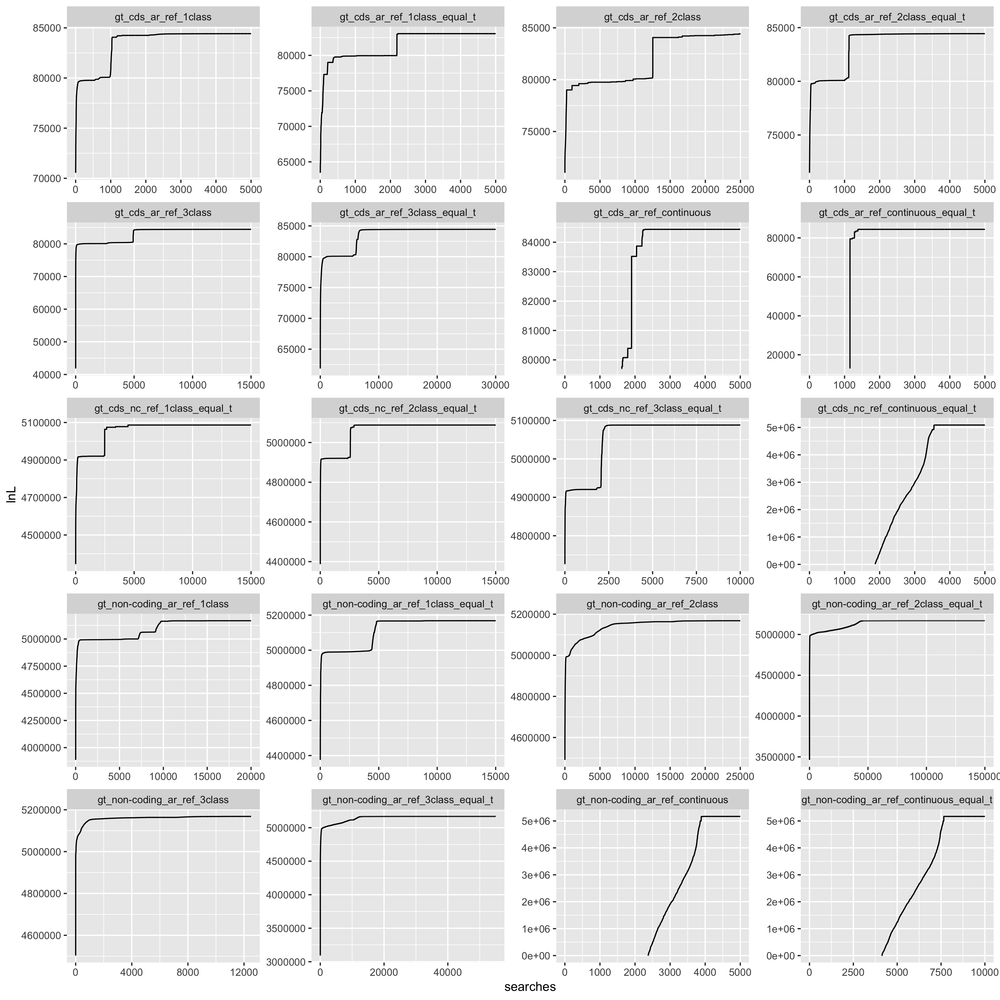

# Analyses and results from applying anavar the INDEL data

Scripts use to run anavar make use of the python module ```anavar_utils``` available at: <https://github.com/henryjuho/anavar_utils>.

## identifying the best fitting model in anavar for CDS and non-coding data

Firstly four different anavar models (1 class, 2 class, 3 class and continuous) were run on INDEL data from coding regions (CDS) with INDELs in ancestral repeats as neutral reference. These were all run as both full models and reduced models where mutation rates were equal between neutral and selected variants.

### CDS equal theta models

```
$ cd ~/parus_indel/anavar_analyses/

$ ~/parus_indel/anavar_analyses/sel_vs_neu_anavar.py -mode indel -vcf /fastdata/bop15hjb/GT_data/BGI_BWA_GATK/Analysis_ready_data/final/bgi_10birds.filtered_indels.pol.anno.recomb.line.vcf.gz -n 20 -call_txt ~/parus_indel/summary_analyses/bgi10_call.txt -c 1 -dfe discrete -out_pre /fastdata/bop15hjb/GT_data/BGI_BWA_GATK/anavar_analysis/cds_vs_ar/gt_cds_ar_ref_1class_equal_t -constraint equal_mutation_rate -n_search 25 -split 200 -alg NLOPT_LN_NELDERMEAD -nnoimp 100 -maximp 1000
$ ~/parus_indel/anavar_analyses/sel_vs_neu_anavar.py -mode indel -vcf /fastdata/bop15hjb/GT_data/BGI_BWA_GATK/Analysis_ready_data/final/bgi_10birds.filtered_indels.pol.anno.recomb.line.vcf.gz -n 20 -call_txt ~/parus_indel/summary_analyses/bgi10_call.txt -c 2 -dfe discrete -out_pre /fastdata/bop15hjb/GT_data/BGI_BWA_GATK/anavar_analysis/cds_vs_ar/gt_cds_ar_ref_2class_equal_t -constraint equal_mutation_rate -n_search 25 -split 200 -alg NLOPT_LN_NELDERMEAD -nnoimp 100 -maximp 1000
$ ~/parus_indel/anavar_analyses/sel_vs_neu_anavar.py -mode indel -vcf /fastdata/bop15hjb/GT_data/BGI_BWA_GATK/Analysis_ready_data/final/bgi_10birds.filtered_indels.pol.anno.recomb.line.vcf.gz -n 20 -call_txt ~/parus_indel/summary_analyses/bgi10_call.txt -c 3 -dfe discrete -out_pre /fastdata/bop15hjb/GT_data/BGI_BWA_GATK/anavar_analysis/cds_vs_ar/gt_cds_ar_ref_3class_equal_t -constraint equal_mutation_rate -n_search 25 -split 200 -alg NLOPT_LN_NELDERMEAD -nnoimp 100 -maximp 1000
$ ~/parus_indel/anavar_analyses/sel_vs_neu_anavar.py -mode indel -vcf /fastdata/bop15hjb/GT_data/BGI_BWA_GATK/Analysis_ready_data/final/bgi_10birds.filtered_indels.pol.anno.recomb.line.vcf.gz -n 20 -call_txt ~/parus_indel/summary_analyses/bgi10_call.txt -c 3 -dfe discrete -out_pre /fastdata/bop15hjb/GT_data/BGI_BWA_GATK/anavar_analysis/cds_vs_ar/gt_cds_ar_ref_3class_equal_t -constraint equal_mutation_rate -n_search 25 -split 400 -alg NLOPT_LN_NELDERMEAD -nnoimp 100 -maximp 1000 -start_index 201 
$ ~/parus_indel/anavar_analyses/sel_vs_neu_anavar.py -mode indel -vcf /fastdata/bop15hjb/GT_data/BGI_BWA_GATK/Analysis_ready_data/final/bgi_10birds.filtered_indels.pol.anno.recomb.line.vcf.gz -n 20 -call_txt ~/parus_indel/summary_analyses/bgi10_call.txt -c 3 -dfe discrete -out_pre /fastdata/bop15hjb/GT_data/BGI_BWA_GATK/anavar_analysis/cds_vs_ar/gt_cds_ar_ref_3class_equal_t -constraint equal_mutation_rate -n_search 25 -split 600 -alg NLOPT_LN_NELDERMEAD -nnoimp 100 -maximp 1000 -start_index 601 -evolgen
$ ~/parus_indel/anavar_analyses/sel_vs_neu_anavar.py -mode indel -vcf /fastdata/bop15hjb/GT_data/BGI_BWA_GATK/Analysis_ready_data/final/bgi_10birds.filtered_indels.pol.anno.recomb.line.vcf.gz -n 20 -call_txt ~/parus_indel/summary_analyses/bgi10_call.txt -c 1 -dfe continuous -degree 500 -n_search 25 -split 200 -out_pre /fastdata/bop15hjb/GT_data/BGI_BWA_GATK/anavar_analysis/cds_vs_ar/gt_cds_ar_ref_continuous_equal_t -constraint equal_mutation_rate -evolgen

$ ls /fastdata/bop15hjb/GT_data/BGI_BWA_GATK/anavar_analysis/cds_vs_ar/*equal_t*merged* | ./process_anavar_results.py > gt_cds_v_ar_indels_equal_t.aic.csv
```

Results [here](gt_cds_v_ar_indels_equal_t.aic.csv).

### CDS equal theta models - NC ref

```bash
 mkdir /fastdata/bop15hjb/h_j_b/GT_data/BGI_BWA_GATK/anavar_analysis/cds_vs_nc

~/parus_indel/anavar_analyses/sel_vs_neu_anavar.py -mode indel -vcf /fastdata/bop15hjb/h_j_b/GT_data/BGI_BWA_GATK/Analysis_ready_data/final/bgi_10birds.filtered_indels.pol.anno.recomb.line.vcf.gz -n 20 -call_txt ~/parus_indel/summary_analyses/bgi10_call.txt -c 1 -dfe discrete -out_pre /fastdata/bop15hjb/h_j_b/GT_data/BGI_BWA_GATK/anavar_analysis/cds_vs_nc/gt_cds_nc_ref_1class_equal_t -constraint equal_mutation_rate -n_search 25 -split 200 -alg NLOPT_LN_NELDERMEAD -nnoimp 100 -maximp 1000 -nc_ref -evolgen
~/parus_indel/anavar_analyses/sel_vs_neu_anavar.py -mode indel -vcf /fastdata/bop15hjb/h_j_b/GT_data/BGI_BWA_GATK/Analysis_ready_data/final/bgi_10birds.filtered_indels.pol.anno.recomb.line.vcf.gz -n 20 -call_txt ~/parus_indel/summary_analyses/bgi10_call.txt -c 2 -dfe discrete -out_pre /fastdata/bop15hjb/h_j_b/GT_data/BGI_BWA_GATK/anavar_analysis/cds_vs_nc/gt_cds_nc_ref_2class_equal_t -constraint equal_mutation_rate -n_search 25 -split 200 -alg NLOPT_LN_NELDERMEAD -nnoimp 100 -maximp 1000 -nc_ref -evolgen
~/parus_indel/anavar_analyses/sel_vs_neu_anavar.py -mode indel -vcf /fastdata/bop15hjb/h_j_b/GT_data/BGI_BWA_GATK/Analysis_ready_data/final/bgi_10birds.filtered_indels.pol.anno.recomb.line.vcf.gz -n 20 -call_txt ~/parus_indel/summary_analyses/bgi10_call.txt -c 3 -dfe discrete -out_pre /fastdata/bop15hjb/h_j_b/GT_data/BGI_BWA_GATK/anavar_analysis/cds_vs_nc/gt_cds_nc_ref_3class_equal_t -constraint equal_mutation_rate -n_search 25 -split 200 -alg NLOPT_LN_NELDERMEAD -nnoimp 100 -maximp 1000 -nc_ref -evolgen
~/parus_indel/anavar_analyses/sel_vs_neu_anavar.py -mode indel -vcf /fastdata/bop15hjb/h_j_b/GT_data/BGI_BWA_GATK/Analysis_ready_data/final/bgi_10birds.filtered_indels.pol.anno.recomb.line.vcf.gz -n 20 -call_txt ~/parus_indel/summary_analyses/bgi10_call.txt -c 1 -dfe continuous -degree 500 -out_pre /fastdata/bop15hjb/h_j_b/GT_data/BGI_BWA_GATK/anavar_analysis/cds_vs_nc/gt_cds_nc_ref_continuous_equal_t -constraint equal_mutation_rate -n_search 25 -split 200 -nc_ref

```

### CDS free theta models

```
$ ~/parus_indel/anavar_analyses/sel_vs_neu_anavar.py -mode indel -vcf /fastdata/bop15hjb/GT_data/BGI_BWA_GATK/Analysis_ready_data/final/bgi_10birds.filtered_indels.pol.anno.recomb.line.vcf.gz -n 20 -call_txt ~/parus_indel/summary_analyses/bgi10_call.txt -c 1 -dfe discrete -out_pre /fastdata/bop15hjb/GT_data/BGI_BWA_GATK/anavar_analysis/cds_vs_ar/gt_cds_ar_ref_1class -n_search 25 -split 200 -alg NLOPT_LN_NELDERMEAD -nnoimp 100 -maximp 1000 -evolgen
$ ~/parus_indel/anavar_analyses/sel_vs_neu_anavar.py -mode indel -vcf /fastdata/bop15hjb/GT_data/BGI_BWA_GATK/Analysis_ready_data/final/bgi_10birds.filtered_indels.pol.anno.recomb.line.vcf.gz -n 20 -call_txt ~/parus_indel/summary_analyses/bgi10_call.txt -c 2 -dfe discrete -out_pre /fastdata/bop15hjb/GT_data/BGI_BWA_GATK/anavar_analysis/cds_vs_ar/gt_cds_ar_ref_2class -n_search 25 -split 200 -alg NLOPT_LD_TNEWTON_PRECOND_RESTART -start_index 2001 -evolgen
$ ~/parus_indel/anavar_analyses/sel_vs_neu_anavar.py -mode indel -vcf /fastdata/bop15hjb/GT_data/BGI_BWA_GATK/Analysis_ready_data/final/bgi_10birds.filtered_indels.pol.anno.recomb.line.vcf.gz -n 20 -call_txt ~/parus_indel/summary_analyses/bgi10_call.txt -c 2 -dfe discrete -out_pre /fastdata/bop15hjb/GT_data/BGI_BWA_GATK/anavar_analysis/cds_vs_ar/gt_cds_ar_ref_2class -n_search 25 -split 1000 -alg NLOPT_LD_TNEWTON_PRECOND_RESTART -start_index 2201 -evolgen
$ ~/parus_indel/anavar_analyses/sel_vs_neu_anavar.py -mode indel -vcf /fastdata/bop15hjb/GT_data/BGI_BWA_GATK/Analysis_ready_data/final/bgi_10birds.filtered_indels.pol.anno.recomb.line.vcf.gz -n 20 -call_txt ~/parus_indel/summary_analyses/bgi10_call.txt -c 2 -dfe discrete -out_pre /fastdata/bop15hjb/GT_data/BGI_BWA_GATK/anavar_analysis/cds_vs_ar/gt_cds_ar_ref_2class -n_search 25 -split 1 -alg NLOPT_LD_TNEWTON_PRECOND_RESTART -start_index 3201 -evolgen
$ ~/parus_indel/anavar_analyses/sel_vs_neu_anavar.py -mode indel -vcf /fastdata/bop15hjb/GT_data/BGI_BWA_GATK/Analysis_ready_data/final/bgi_10birds.filtered_indels.pol.anno.recomb.line.vcf.gz -n 20 -call_txt ~/parus_indel/summary_analyses/bgi10_call.txt -c 3 -dfe discrete -out_pre /fastdata/bop15hjb/GT_data/BGI_BWA_GATK/anavar_analysis/cds_vs_ar/gt_cds_ar_ref_3class -n_search 25 -split 200 -alg NLOPT_LN_NELDERMEAD -nnoimp 100 -maximp 1000 -evolgen
$ ~/parus_indel/anavar_analyses/sel_vs_neu_anavar.py -mode indel -vcf /fastdata/bop15hjb/GT_data/BGI_BWA_GATK/Analysis_ready_data/final/bgi_10birds.filtered_indels.pol.anno.recomb.line.vcf.gz -n 20 -call_txt ~/parus_indel/summary_analyses/bgi10_call.txt -c 3 -dfe discrete -out_pre /fastdata/bop15hjb/GT_data/BGI_BWA_GATK/anavar_analysis/cds_vs_ar/gt_cds_ar_ref_3class -n_search 25 -split 400 -alg NLOPT_LN_NELDERMEAD -nnoimp 100 -maximp 1000 -start_index 201 
$ ~/parus_indel/anavar_analyses/sel_vs_neu_anavar.py -mode indel -vcf /fastdata/bop15hjb/GT_data/BGI_BWA_GATK/Analysis_ready_data/final/bgi_10birds.filtered_indels.pol.anno.recomb.line.vcf.gz -n 20 -call_txt ~/parus_indel/summary_analyses/bgi10_call.txt -c 1 -dfe continuous -degree 500 -n_search 25 -split 200 -out_pre /fastdata/bop15hjb/GT_data/BGI_BWA_GATK/anavar_analysis/cds_vs_ar/gt_cds_ar_ref_continuous -evolgen

$ ls /fastdata/bop15hjb/GT_data/BGI_BWA_GATK/anavar_analysis/cds_vs_ar/*merged* | grep -v equal_t | ./process_anavar_results.py > gt_cds_v_ar_indels_full.aic.csv
```

Results [here](gt_cds_v_ar_indels_full.aic.csv)


### Non-coding equal theta models

Secondly this process was repeated to determine the best model for the non-coding data.

```
$ ~/parus_indel/anavar_analyses/sel_vs_neu_anavar.py -mode indel -vcf /fastdata/bop15hjb/GT_data/BGI_BWA_GATK/Analysis_ready_data/final/bgi_10birds.filtered_indels.pol.anno.recomb.line.vcf.gz -n 20 -call_txt ~/parus_indel/summary_analyses/bgi10_call.txt -c 1 -dfe discrete -out_pre /fastdata/bop15hjb/GT_data/BGI_BWA_GATK/anavar_analysis/non-coding_vs_ar/gt_non-coding_ar_ref_1class_equal_t -constraint equal_mutation_rate -sel_type noncoding -n_search 25 -split 200 -alg NLOPT_LN_NELDERMEAD -nnoimp 100 -maximp 1000
$ ~/parus_indel/anavar_analyses/sel_vs_neu_anavar.py -mode indel -vcf /fastdata/bop15hjb/GT_data/BGI_BWA_GATK/Analysis_ready_data/final/bgi_10birds.filtered_indels.pol.anno.recomb.line.vcf.gz -n 20 -call_txt ~/parus_indel/summary_analyses/bgi10_call.txt -c 1 -dfe discrete -out_pre /fastdata/bop15hjb/GT_data/BGI_BWA_GATK/anavar_analysis/non-coding_vs_ar/gt_non-coding_ar_ref_1class_equal_t -constraint equal_mutation_rate -sel_type noncoding -n_search 25 -split 400 -alg NLOPT_LN_NELDERMEAD -nnoimp 100 -maximp 1000 -start_index 201
$ ~/parus_indel/anavar_analyses/sel_vs_neu_anavar.py -mode indel -vcf /fastdata/bop15hjb/GT_data/BGI_BWA_GATK/Analysis_ready_data/final/bgi_10birds.filtered_indels.pol.anno.recomb.line.vcf.gz -n 20 -call_txt ~/parus_indel/summary_analyses/bgi10_call.txt -c 2 -dfe discrete -n_search 25 -split 200 -out_pre /fastdata/bop15hjb/GT_data/BGI_BWA_GATK/anavar_analysis/non-coding_vs_ar/gt_non-coding_ar_ref_2class_equal_t -constraint equal_mutation_rate -evolgen -sel_type noncoding -alg NLOPT_LN_NELDERMEAD -nnoimp 100 -maximp 1000
$ ~/parus_indel/anavar_analyses/sel_vs_neu_anavar.py -mode indel -vcf /fastdata/bop15hjb/GT_data/BGI_BWA_GATK/Analysis_ready_data/final/bgi_10birds.filtered_indels.pol.anno.recomb.line.vcf.gz -n 20 -call_txt ~/parus_indel/summary_analyses/bgi10_call.txt -c 2 -dfe discrete -n_search 25 -split 400 -out_pre /fastdata/bop15hjb/GT_data/BGI_BWA_GATK/anavar_analysis/non-coding_vs_ar/gt_non-coding_ar_ref_2class_equal_t -constraint equal_mutation_rate -sel_type noncoding -alg NLOPT_LN_NELDERMEAD -nnoimp 100 -maximp 1000 -start_index 201
$ ~/parus_indel/anavar_analyses/sel_vs_neu_anavar.py -mode indel -vcf /fastdata/bop15hjb/GT_data/BGI_BWA_GATK/Analysis_ready_data/final/bgi_10birds.filtered_indels.pol.anno.recomb.line.vcf.gz -n 20 -call_txt ~/parus_indel/summary_analyses/bgi10_call.txt -c 2 -dfe discrete -n_search 25 -split 600 -out_pre /fastdata/bop15hjb/GT_data/BGI_BWA_GATK/anavar_analysis/non-coding_vs_ar/gt_non-coding_ar_ref_2class_equal_t -constraint equal_mutation_rate -sel_type noncoding -alg NLOPT_LN_NELDERMEAD -nnoimp 100 -maximp 1000 -start_index 601
$ ~/parus_indel/anavar_analyses/sel_vs_neu_anavar.py -mode indel -vcf /fastdata/bop15hjb/GT_data/BGI_BWA_GATK/Analysis_ready_data/final/bgi_10birds.filtered_indels.pol.anno.recomb.line.vcf.gz -n 20 -call_txt ~/parus_indel/summary_analyses/bgi10_call.txt -c 2 -dfe discrete -n_search 25 -split 400 -out_pre /fastdata/bop15hjb/GT_data/BGI_BWA_GATK/anavar_analysis/non-coding_vs_ar/gt_non-coding_ar_ref_2class_equal_t -constraint equal_mutation_rate -sel_type noncoding -alg NLOPT_LN_NELDERMEAD -nnoimp 100 -maximp 1000 -start_index 1201
$ ~/parus_indel/anavar_analyses/sel_vs_neu_anavar.py -mode indel -vcf /fastdata/bop15hjb/GT_data/BGI_BWA_GATK/Analysis_ready_data/final/bgi_10birds.filtered_indels.pol.anno.recomb.line.vcf.gz -n 20 -call_txt ~/parus_indel/summary_analyses/bgi10_call.txt -c 2 -dfe discrete -n_search 25 -split 1000 -out_pre /fastdata/bop15hjb/GT_data/BGI_BWA_GATK/anavar_analysis/non-coding_vs_ar/gt_non-coding_ar_ref_2class_equal_t -constraint equal_mutation_rate -sel_type noncoding -alg NLOPT_LN_NELDERMEAD -nnoimp 5 -maximp 100 -start_index 1601 -evolgen
$ ~/parus_indel/anavar_analyses/sel_vs_neu_anavar.py -mode indel -vcf /fastdata/bop15hjb/GT_data/BGI_BWA_GATK/Analysis_ready_data/final/bgi_10birds.filtered_indels.pol.anno.recomb.line.vcf.gz -n 20 -call_txt ~/parus_indel/summary_analyses/bgi10_call.txt -c 2 -dfe discrete -out_pre /fastdata/bop15hjb/GT_data/BGI_BWA_GATK/anavar_analysis/non-coding_vs_ar/gt_non-coding_ar_ref_2class_equal_t -constraint equal_mutation_rate -sel_type noncoding -alg NLOPT_LN_NELDERMEAD -n_search 25 -split 1000 -nnoimp 5 -maximp 150 -start_index 2601 -evolgen
$ ~/parus_indel/anavar_analyses/sel_vs_neu_anavar.py -mode indel -vcf /fastdata/bop15hjb/GT_data/BGI_BWA_GATK/Analysis_ready_data/final/bgi_10birds.filtered_indels.pol.anno.recomb.line.vcf.gz -n 20 -call_txt ~/parus_indel/summary_analyses/bgi10_call.txt -c 2 -dfe discrete -out_pre /fastdata/bop15hjb/GT_data/BGI_BWA_GATK/anavar_analysis/non-coding_vs_ar/gt_non-coding_ar_ref_2class_equal_t -constraint equal_mutation_rate -sel_type noncoding -alg NLOPT_LN_NELDERMEAD -n_search 25 -split 1400 -nnoimp 10 -maximp 150 -start_index 3601 -evolgen
$ ~/parus_indel/anavar_analyses/sel_vs_neu_anavar.py -mode indel -vcf /fastdata/bop15hjb/GT_data/BGI_BWA_GATK/Analysis_ready_data/final/bgi_10birds.filtered_indels.pol.anno.recomb.line.vcf.gz -n 20 -call_txt ~/parus_indel/summary_analyses/bgi10_call.txt -c 2 -dfe discrete -out_pre /fastdata/bop15hjb/GT_data/BGI_BWA_GATK/anavar_analysis/non-coding_vs_ar/gt_non-coding_ar_ref_2class_equal_t -constraint equal_mutation_rate -sel_type noncoding -alg NLOPT_LN_NELDERMEAD -n_search 25 -split 1000 -nnoimp 25 -maximp 200 -start_index 5001 -evolgen
$ ~/parus_indel/anavar_analyses/sel_vs_neu_anavar.py -mode indel -vcf /fastdata/bop15hjb/GT_data/BGI_BWA_GATK/Analysis_ready_data/final/bgi_10birds.filtered_indels.pol.anno.recomb.line.vcf.gz -n 20 -call_txt ~/parus_indel/summary_analyses/bgi10_call.txt -c 3 -dfe discrete -out_pre /fastdata/bop15hjb/GT_data/BGI_BWA_GATK/anavar_analysis/non-coding_vs_ar/gt_non-coding_ar_ref_3class_equal_t -constraint equal_mutation_rate -sel_type noncoding -n_search 25 -split 200 -alg NLOPT_LN_NELDERMEAD -nnoimp 100 -maximp 1000
$ ~/parus_indel/anavar_analyses/sel_vs_neu_anavar.py -mode indel -vcf /fastdata/bop15hjb/GT_data/BGI_BWA_GATK/Analysis_ready_data/final/bgi_10birds.filtered_indels.pol.anno.recomb.line.vcf.gz -n 20 -call_txt ~/parus_indel/summary_analyses/bgi10_call.txt -c 3 -dfe discrete -out_pre /fastdata/bop15hjb/GT_data/BGI_BWA_GATK/anavar_analysis/non-coding_vs_ar/gt_non-coding_ar_ref_3class_equal_t -constraint equal_mutation_rate -sel_type noncoding -alg NLOPT_LN_NELDERMEAD -n_search 25 -split 1000 -nnoimp 5 -maximp 150 -start_index 201 -evolgen
$ ~/parus_indel/anavar_analyses/sel_vs_neu_anavar.py -mode indel -vcf /fastdata/bop15hjb/GT_data/BGI_BWA_GATK/Analysis_ready_data/final/bgi_10birds.filtered_indels.pol.anno.recomb.line.vcf.gz -n 20 -call_txt ~/parus_indel/summary_analyses/bgi10_call.txt -c 3 -dfe discrete -out_pre /fastdata/bop15hjb/GT_data/BGI_BWA_GATK/anavar_analysis/non-coding_vs_ar/gt_non-coding_ar_ref_3class_equal_t -constraint equal_mutation_rate -sel_type noncoding -alg NLOPT_LN_NELDERMEAD -n_search 25 -split 1000 -nnoimp 25 -maximp 200 -start_index 1201 -evolgen
$ ~/parus_indel/anavar_analyses/sel_vs_neu_anavar.py -mode indel -vcf /fastdata/bop15hjb/GT_data/BGI_BWA_GATK/Analysis_ready_data/final/bgi_10birds.filtered_indels.pol.anno.recomb.line.vcf.gz -n 20 -call_txt ~/parus_indel/summary_analyses/bgi10_call.txt -c 1 -dfe continuous -degree 500 -n_search 20 -split 250 -out_pre /fastdata/bop15hjb/GT_data/BGI_BWA_GATK/anavar_analysis/non-coding_vs_ar/gt_non-coding_ar_ref_continuous_equal_t -constraint equal_mutation_rate -evolgen -sel_type noncoding

$ ls /fastdata/bop15hjb/GT_data/BGI_BWA_GATK/anavar_analysis/non-coding_vs_ar/*equal_t*merged* | ./process_anavar_results.py > gt_non-coding_v_ar_indels_equal_t.aic.csv
```

Results [here](gt_non-coding_v_ar_indels_equal_t.aic.csv).

### Non-coding free theta models

```
$ ~/parus_indel/anavar_analyses/sel_vs_neu_anavar.py -mode indel -vcf /fastdata/bop15hjb/GT_data/BGI_BWA_GATK/Analysis_ready_data/final/bgi_10birds.filtered_indels.pol.anno.recomb.line.vcf.gz -n 20 -call_txt ~/parus_indel/summary_analyses/bgi10_call.txt -c 1 -dfe discrete -out_pre /fastdata/bop15hjb/GT_data/BGI_BWA_GATK/anavar_analysis/non-coding_vs_ar/gt_non-coding_ar_ref_1class -sel_type noncoding -n_search 25 -split 200 -alg NLOPT_LN_NELDERMEAD -nnoimp 100 -maximp 1000
$ ~/parus_indel/anavar_analyses/sel_vs_neu_anavar.py -mode indel -vcf /fastdata/bop15hjb/GT_data/BGI_BWA_GATK/Analysis_ready_data/final/bgi_10birds.filtered_indels.pol.anno.recomb.line.vcf.gz -n 20 -call_txt ~/parus_indel/summary_analyses/bgi10_call.txt -c 1 -dfe discrete -out_pre /fastdata/bop15hjb/GT_data/BGI_BWA_GATK/anavar_analysis/non-coding_vs_ar/gt_non-coding_ar_ref_1class -sel_type noncoding -n_search 25 -split 600 -alg NLOPT_LN_NELDERMEAD -nnoimp 100 -maximp 1000 -start_index 201
$ ~/parus_indel/anavar_analyses/sel_vs_neu_anavar.py -mode indel -vcf /fastdata/bop15hjb/GT_data/BGI_BWA_GATK/Analysis_ready_data/final/bgi_10birds.filtered_indels.pol.anno.recomb.line.vcf.gz -n 20 -call_txt ~/parus_indel/summary_analyses/bgi10_call.txt -c 2 -dfe discrete -out_pre /fastdata/bop15hjb/GT_data/BGI_BWA_GATK/anavar_analysis/non-coding_vs_ar/gt_non-coding_ar_ref_2class -sel_type noncoding  -n_search 25 -split 400 -alg NLOPT_LN_NELDERMEAD -nnoimp 100 -maximp 1000
$ ~/parus_indel/anavar_analyses/sel_vs_neu_anavar.py -mode indel -vcf /fastdata/bop15hjb/GT_data/BGI_BWA_GATK/Analysis_ready_data/final/bgi_10birds.filtered_indels.pol.anno.recomb.line.vcf.gz -n 20 -call_txt ~/parus_indel/summary_analyses/bgi10_call.txt -c 2 -dfe discrete -out_pre /fastdata/bop15hjb/GT_data/BGI_BWA_GATK/anavar_analysis/non-coding_vs_ar/gt_non-coding_ar_ref_2class -sel_type noncoding  -n_search 25 -split 200 -alg NLOPT_LN_NELDERMEAD -nnoimp 100 -maximp 1000 -start_index 401
$ ~/parus_indel/anavar_analyses/sel_vs_neu_anavar.py -mode indel -vcf /fastdata/bop15hjb/GT_data/BGI_BWA_GATK/Analysis_ready_data/final/bgi_10birds.filtered_indels.pol.anno.recomb.line.vcf.gz -n 20 -call_txt ~/parus_indel/summary_analyses/bgi10_call.txt -c 2 -dfe discrete -out_pre /fastdata/bop15hjb/GT_data/BGI_BWA_GATK/anavar_analysis/non-coding_vs_ar/gt_non-coding_ar_ref_2class -sel_type noncoding  -alg NLOPT_LN_NELDERMEAD -n_search 25 -split 1000 -nnoimp 25 -maximp 200 -start_index 601 -evolgen
$ ~/parus_indel/anavar_analyses/sel_vs_neu_anavar.py -mode indel -vcf /fastdata/bop15hjb/GT_data/BGI_BWA_GATK/Analysis_ready_data/final/bgi_10birds.filtered_indels.pol.anno.recomb.line.vcf.gz -n 20 -call_txt ~/parus_indel/summary_analyses/bgi10_call.txt -c 3 -dfe discrete -out_pre /fastdata/bop15hjb/GT_data/BGI_BWA_GATK/anavar_analysis/non-coding_vs_ar/gt_non-coding_ar_ref_3class -sel_type noncoding -n_search 25 -split 400 -alg NLOPT_LN_NELDERMEAD -nnoimp 100 -maximp 1000
$ ~/parus_indel/anavar_analyses/sel_vs_neu_anavar.py -mode indel -vcf /fastdata/bop15hjb/GT_data/BGI_BWA_GATK/Analysis_ready_data/final/bgi_10birds.filtered_indels.pol.anno.recomb.line.vcf.gz -n 20 -call_txt ~/parus_indel/summary_analyses/bgi10_call.txt -c 3 -dfe discrete -out_pre /fastdata/bop15hjb/GT_data/BGI_BWA_GATK/anavar_analysis/non-coding_vs_ar/gt_non-coding_ar_ref_3class -sel_type noncoding -n_search 25 -split 200 -alg NLOPT_LN_NELDERMEAD -nnoimp 100 -maximp 1000 -start_index 401
$ ~/parus_indel/anavar_analyses/sel_vs_neu_anavar.py -mode indel -vcf /fastdata/bop15hjb/GT_data/BGI_BWA_GATK/Analysis_ready_data/final/bgi_10birds.filtered_indels.pol.anno.recomb.line.vcf.gz -n 20 -call_txt ~/parus_indel/summary_analyses/bgi10_call.txt -c 3 -dfe discrete -out_pre /fastdata/bop15hjb/GT_data/BGI_BWA_GATK/anavar_analysis/non-coding_vs_ar/gt_non-coding_ar_ref_3class -sel_type noncoding -alg NLOPT_LN_NELDERMEAD -n_search 25 -split 500 -nnoimp 25 -maximp 200 -start_index 601 -evolgen
$ ~/parus_indel/anavar_analyses/sel_vs_neu_anavar.py -mode indel -vcf /fastdata/bop15hjb/GT_data/BGI_BWA_GATK/Analysis_ready_data/final/bgi_10birds.filtered_indels.pol.anno.recomb.line.vcf.gz -n 20 -call_txt ~/parus_indel/summary_analyses/bgi10_call.txt -c 1 -dfe continuous -degree 500 -n_search 20 -split 250 -out_pre /fastdata/bop15hjb/GT_data/BGI_BWA_GATK/anavar_analysis/non-coding_vs_ar/gt_non-coding_ar_ref_continuous -evolgen -sel_type noncoding

$ ls /fastdata/bop15hjb/GT_data/BGI_BWA_GATK/anavar_analysis/non-coding_vs_ar/*merged* | grep -v equal_t | ./process_anavar_results.py > gt_non-coding_v_ar_indels_full.aic.csv
```

Results [here](gt_non-coding_v_ar_indels_full.aic.csv).


## Convergence

Convergence was visually checked:

```
$ ls /fastdata/bop15hjb/GT_data/BGI_BWA_GATK/anavar_analysis/non-coding_vs_ar/*merged.results.txt /fastdata/bop15hjb/GT_data/BGI_BWA_GATK/anavar_analysis/cds_vs_ar/*merged.results.txt | python check_lnL.py > all_models_lnl.txt
$ Rscript lnl_landscape.R 
```



## Plotting gamma DFE

```
$ ./gen_gamma_plot_data.py -sh_d 0.106 -sc_d 715 -sh_i 0.0345 -sc_i 1553 > dfe_plotdata.txt
```