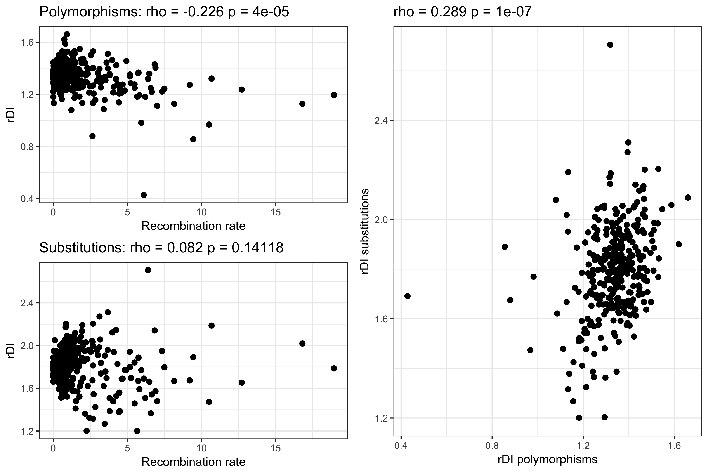
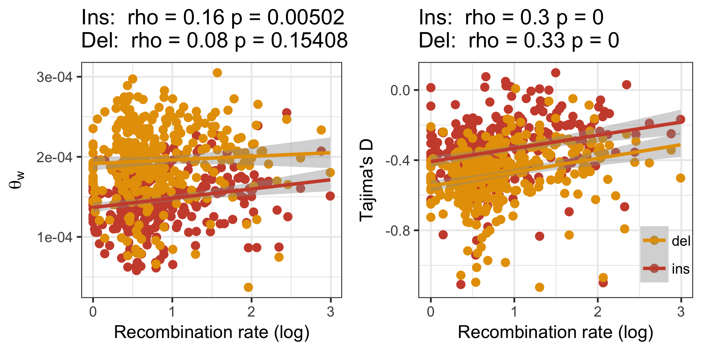

# Analyses and results from applying anavar the INDEL data

Scripts use to run anavar make use of the python module ```anavar_utils``` available at: <https://github.com/henryjuho/anavar_utils>.

## identifying the best fitting model in anavar for CDS and non-coding data

Firstly four different anavar models (1 class, 2 class, 3 class and continuous) were run on INDEL data from coding regions (CDS) with INDELs in ancestral repeats as neutral reference. These were all run as both full models and reduced models where mutation rates were equal between neutral and selected variants.

### CDS equal theta models

```
$ cd ~/parus_indel/anavar_analyses/

$ ~/parus_indel/anavar_analyses/sel_vs_neu_anavar.py -mode indel -vcf /fastdata/bop15hjb/GT_data/BGI_BWA_GATK/Analysis_ready_data/final/bgi_10birds.filtered_indels.pol.anno.recomb.line.vcf.gz -n 20 -call_txt ~/parus_indel/summary_analyses/bgi10_call.txt -c 1 -dfe discrete -out_pre /fastdata/bop15hjb/GT_data/BGI_BWA_GATK/anavar_analysis/cds_vs_ar/gt_cds_ar_ref_1class_equal_t -constraint equal_mutation_rate -n_search 25 -split 200 -alg NLOPT_LN_NELDERMEAD -nnoimp 100 -maximp 1000
$ ~/parus_indel/anavar_analyses/sel_vs_neu_anavar.py -mode indel -vcf /fastdata/bop15hjb/GT_data/BGI_BWA_GATK/Analysis_ready_data/final/bgi_10birds.filtered_indels.pol.anno.recomb.line.vcf.gz -n 20 -call_txt ~/parus_indel/summary_analyses/bgi10_call.txt -c 2 -dfe discrete -out_pre /fastdata/bop15hjb/GT_data/BGI_BWA_GATK/anavar_analysis/cds_vs_ar/gt_cds_ar_ref_2class_equal_t -constraint equal_mutation_rate -n_search 25 -split 200 -alg NLOPT_LN_NELDERMEAD -nnoimp 100 -maximp 1000
$ ~/parus_indel/anavar_analyses/sel_vs_neu_anavar.py -mode indel -vcf /fastdata/bop15hjb/GT_data/BGI_BWA_GATK/Analysis_ready_data/final/bgi_10birds.filtered_indels.pol.anno.recomb.line.vcf.gz -n 20 -call_txt ~/parus_indel/summary_analyses/bgi10_call.txt -c 3 -dfe discrete -out_pre /fastdata/bop15hjb/GT_data/BGI_BWA_GATK/anavar_analysis/cds_vs_ar/gt_cds_ar_ref_3class_equal_t -constraint equal_mutation_rate -n_search 25 -split 200 -alg NLOPT_LN_NELDERMEAD -nnoimp 100 -maximp 1000
$ ~/parus_indel/anavar_analyses/sel_vs_neu_anavar.py -mode indel -vcf /fastdata/bop15hjb/GT_data/BGI_BWA_GATK/Analysis_ready_data/final/bgi_10birds.filtered_indels.pol.anno.recomb.line.vcf.gz -n 20 -call_txt ~/parus_indel/summary_analyses/bgi10_call.txt -c 3 -dfe discrete -out_pre /fastdata/bop15hjb/GT_data/BGI_BWA_GATK/anavar_analysis/cds_vs_ar/gt_cds_ar_ref_3class_equal_t -constraint equal_mutation_rate -n_search 25 -split 400 -alg NLOPT_LN_NELDERMEAD -nnoimp 100 -maximp 1000 -start_index 201 
$ ~/parus_indel/anavar_analyses/sel_vs_neu_anavar.py -mode indel -vcf /fastdata/bop15hjb/GT_data/BGI_BWA_GATK/Analysis_ready_data/final/bgi_10birds.filtered_indels.pol.anno.recomb.line.vcf.gz -n 20 -call_txt ~/parus_indel/summary_analyses/bgi10_call.txt -c 3 -dfe discrete -out_pre /fastdata/bop15hjb/GT_data/BGI_BWA_GATK/anavar_analysis/cds_vs_ar/gt_cds_ar_ref_3class_equal_t -constraint equal_mutation_rate -n_search 25 -split 600 -alg NLOPT_LN_NELDERMEAD -nnoimp 100 -maximp 1000 -start_index 601 -evolgen
$ ~/parus_indel/anavar_analyses/sel_vs_neu_anavar.py -mode indel -vcf /fastdata/bop15hjb/GT_data/BGI_BWA_GATK/Analysis_ready_data/final/bgi_10birds.filtered_indels.pol.anno.recomb.line.vcf.gz -n 20 -call_txt ~/parus_indel/summary_analyses/bgi10_call.txt -c 1 -dfe continuous -degree 500 -n_search 25 -split 200 -out_pre /fastdata/bop15hjb/GT_data/BGI_BWA_GATK/anavar_analysis/cds_vs_ar/gt_cds_ar_ref_continuous_equal_t -constraint equal_mutation_rate -evolgen

$ ls /fastdata/bop15hjb/GT_data/BGI_BWA_GATK/anavar_analysis/cds_vs_ar/*equal_t*merged* | ./process_anavar_results.py > gt_cds_v_ar_indels_equal_t.aic.csv
```

Results [here](gt_cds_v_ar_indels_equal_t.aic.csv).

### CDS free theta models

```
$ ~/parus_indel/anavar_analyses/sel_vs_neu_anavar.py -mode indel -vcf /fastdata/bop15hjb/GT_data/BGI_BWA_GATK/Analysis_ready_data/final/bgi_10birds.filtered_indels.pol.anno.recomb.line.vcf.gz -n 20 -call_txt ~/parus_indel/summary_analyses/bgi10_call.txt -c 1 -dfe discrete -out_pre /fastdata/bop15hjb/GT_data/BGI_BWA_GATK/anavar_analysis/cds_vs_ar/gt_cds_ar_ref_1class -n_search 25 -split 200 -alg NLOPT_LN_NELDERMEAD -nnoimp 100 -maximp 1000 -evolgen
$ ~/parus_indel/anavar_analyses/sel_vs_neu_anavar.py -mode indel -vcf /fastdata/bop15hjb/GT_data/BGI_BWA_GATK/Analysis_ready_data/final/bgi_10birds.filtered_indels.pol.anno.recomb.line.vcf.gz -n 20 -call_txt ~/parus_indel/summary_analyses/bgi10_call.txt -c 2 -dfe discrete -out_pre /fastdata/bop15hjb/GT_data/BGI_BWA_GATK/anavar_analysis/cds_vs_ar/gt_cds_ar_ref_2class -n_search 25 -split 200 -alg NLOPT_LN_NELDERMEAD -nnoimp 100 -maximp 1000 -evolgen
$ ~/parus_indel/anavar_analyses/sel_vs_neu_anavar.py -mode indel -vcf /fastdata/bop15hjb/GT_data/BGI_BWA_GATK/Analysis_ready_data/final/bgi_10birds.filtered_indels.pol.anno.recomb.line.vcf.gz -n 20 -call_txt ~/parus_indel/summary_analyses/bgi10_call.txt -c 2 -dfe discrete -out_pre /fastdata/bop15hjb/GT_data/BGI_BWA_GATK/anavar_analysis/cds_vs_ar/gt_cds_ar_ref_2class -n_search 25 -split 400 -alg NLOPT_LN_NELDERMEAD -nnoimp 100 -maximp 1000 -start_index 201 
$ ~/parus_indel/anavar_analyses/sel_vs_neu_anavar.py -mode indel -vcf /fastdata/bop15hjb/GT_data/BGI_BWA_GATK/Analysis_ready_data/final/bgi_10birds.filtered_indels.pol.anno.recomb.line.vcf.gz -n 20 -call_txt ~/parus_indel/summary_analyses/bgi10_call.txt -c 2 -dfe discrete -out_pre /fastdata/bop15hjb/GT_data/BGI_BWA_GATK/anavar_analysis/cds_vs_ar/gt_cds_ar_ref_2class -n_search 25 -split 600 -alg NLOPT_LN_NELDERMEAD -nnoimp 100 -maximp 1000 -start_index 601 -evolgen
$ ~/parus_indel/anavar_analyses/sel_vs_neu_anavar.py -mode indel -vcf /fastdata/bop15hjb/GT_data/BGI_BWA_GATK/Analysis_ready_data/final/bgi_10birds.filtered_indels.pol.anno.recomb.line.vcf.gz -n 20 -call_txt ~/parus_indel/summary_analyses/bgi10_call.txt -c 2 -dfe discrete -out_pre /fastdata/bop15hjb/GT_data/BGI_BWA_GATK/anavar_analysis/cds_vs_ar/gt_cds_ar_ref_2class -n_search 25 -split 600 -alg NLOPT_LN_NELDERMEAD -nnoimp 100 -maximp 1000 -start_index 1201
$ ~/parus_indel/anavar_analyses/sel_vs_neu_anavar.py -mode indel -vcf /fastdata/bop15hjb/GT_data/BGI_BWA_GATK/Analysis_ready_data/final/bgi_10birds.filtered_indels.pol.anno.recomb.line.vcf.gz -n 20 -call_txt ~/parus_indel/summary_analyses/bgi10_call.txt -c 2 -dfe discrete -out_pre /fastdata/bop15hjb/GT_data/BGI_BWA_GATK/anavar_analysis/cds_vs_ar/gt_cds_ar_ref_2class -n_search 25 -split 200 -alg NLOPT_LN_NELDERMEAD -nnoimp 100 -maximp 1000 -start_index 1801
$ ~/parus_indel/anavar_analyses/sel_vs_neu_anavar.py -mode indel -vcf /fastdata/bop15hjb/GT_data/BGI_BWA_GATK/Analysis_ready_data/final/bgi_10birds.filtered_indels.pol.anno.recomb.line.vcf.gz -n 20 -call_txt ~/parus_indel/summary_analyses/bgi10_call.txt -c 3 -dfe discrete -out_pre /fastdata/bop15hjb/GT_data/BGI_BWA_GATK/anavar_analysis/cds_vs_ar/gt_cds_ar_ref_3class -n_search 25 -split 200 -alg NLOPT_LN_NELDERMEAD -nnoimp 100 -maximp 1000 -evolgen
$ ~/parus_indel/anavar_analyses/sel_vs_neu_anavar.py -mode indel -vcf /fastdata/bop15hjb/GT_data/BGI_BWA_GATK/Analysis_ready_data/final/bgi_10birds.filtered_indels.pol.anno.recomb.line.vcf.gz -n 20 -call_txt ~/parus_indel/summary_analyses/bgi10_call.txt -c 3 -dfe discrete -out_pre /fastdata/bop15hjb/GT_data/BGI_BWA_GATK/anavar_analysis/cds_vs_ar/gt_cds_ar_ref_3class -n_search 25 -split 400 -alg NLOPT_LN_NELDERMEAD -nnoimp 100 -maximp 1000 -start_index 201 
$ ~/parus_indel/anavar_analyses/sel_vs_neu_anavar.py -mode indel -vcf /fastdata/bop15hjb/GT_data/BGI_BWA_GATK/Analysis_ready_data/final/bgi_10birds.filtered_indels.pol.anno.recomb.line.vcf.gz -n 20 -call_txt ~/parus_indel/summary_analyses/bgi10_call.txt -c 1 -dfe continuous -degree 500 -n_search 25 -split 200 -out_pre /fastdata/bop15hjb/GT_data/BGI_BWA_GATK/anavar_analysis/cds_vs_ar/gt_cds_ar_ref_continuous -evolgen

$ ls /fastdata/bop15hjb/GT_data/BGI_BWA_GATK/anavar_analysis/cds_vs_ar/*merged* | grep -v equal_t | ./process_anavar_results.py > gt_cds_v_ar_indels_full.aic.csv
```

Results [here](gt_cds_v_ar_indels_full.aic.csv)


### Non-coding equal theta models

Secondly this process was repeated to determine the best model for the non-coding data.

```
$ ~/parus_indel/anavar_analyses/sel_vs_neu_anavar.py -mode indel -vcf /fastdata/bop15hjb/GT_data/BGI_BWA_GATK/Analysis_ready_data/final/bgi_10birds.filtered_indels.pol.anno.recomb.line.vcf.gz -n 20 -call_txt ~/parus_indel/summary_analyses/bgi10_call.txt -c 1 -dfe discrete -out_pre /fastdata/bop15hjb/GT_data/BGI_BWA_GATK/anavar_analysis/non-coding_vs_ar/gt_non-coding_ar_ref_1class_equal_t -constraint equal_mutation_rate -sel_type noncoding -n_search 25 -split 200 -alg NLOPT_LN_NELDERMEAD -nnoimp 100 -maximp 1000
$ ~/parus_indel/anavar_analyses/sel_vs_neu_anavar.py -mode indel -vcf /fastdata/bop15hjb/GT_data/BGI_BWA_GATK/Analysis_ready_data/final/bgi_10birds.filtered_indels.pol.anno.recomb.line.vcf.gz -n 20 -call_txt ~/parus_indel/summary_analyses/bgi10_call.txt -c 1 -dfe discrete -out_pre /fastdata/bop15hjb/GT_data/BGI_BWA_GATK/anavar_analysis/non-coding_vs_ar/gt_non-coding_ar_ref_1class_equal_t -constraint equal_mutation_rate -sel_type noncoding -n_search 25 -split 400 -alg NLOPT_LN_NELDERMEAD -nnoimp 100 -maximp 1000 -start_index 201
$ ~/parus_indel/anavar_analyses/sel_vs_neu_anavar.py -mode indel -vcf /fastdata/bop15hjb/GT_data/BGI_BWA_GATK/Analysis_ready_data/final/bgi_10birds.filtered_indels.pol.anno.recomb.line.vcf.gz -n 20 -call_txt ~/parus_indel/summary_analyses/bgi10_call.txt -c 2 -dfe discrete -n_search 25 -split 200 -out_pre /fastdata/bop15hjb/GT_data/BGI_BWA_GATK/anavar_analysis/non-coding_vs_ar/gt_non-coding_ar_ref_2class_equal_t -constraint equal_mutation_rate -evolgen -sel_type noncoding -alg NLOPT_LN_NELDERMEAD -nnoimp 100 -maximp 1000
$ ~/parus_indel/anavar_analyses/sel_vs_neu_anavar.py -mode indel -vcf /fastdata/bop15hjb/GT_data/BGI_BWA_GATK/Analysis_ready_data/final/bgi_10birds.filtered_indels.pol.anno.recomb.line.vcf.gz -n 20 -call_txt ~/parus_indel/summary_analyses/bgi10_call.txt -c 2 -dfe discrete -n_search 25 -split 400 -out_pre /fastdata/bop15hjb/GT_data/BGI_BWA_GATK/anavar_analysis/non-coding_vs_ar/gt_non-coding_ar_ref_2class_equal_t -constraint equal_mutation_rate -sel_type noncoding -alg NLOPT_LN_NELDERMEAD -nnoimp 100 -maximp 1000 -start_index 201
$ ~/parus_indel/anavar_analyses/sel_vs_neu_anavar.py -mode indel -vcf /fastdata/bop15hjb/GT_data/BGI_BWA_GATK/Analysis_ready_data/final/bgi_10birds.filtered_indels.pol.anno.recomb.line.vcf.gz -n 20 -call_txt ~/parus_indel/summary_analyses/bgi10_call.txt -c 2 -dfe discrete -n_search 25 -split 600 -out_pre /fastdata/bop15hjb/GT_data/BGI_BWA_GATK/anavar_analysis/non-coding_vs_ar/gt_non-coding_ar_ref_2class_equal_t -constraint equal_mutation_rate -sel_type noncoding -alg NLOPT_LN_NELDERMEAD -nnoimp 100 -maximp 1000 -start_index 601
$ ~/parus_indel/anavar_analyses/sel_vs_neu_anavar.py -mode indel -vcf /fastdata/bop15hjb/GT_data/BGI_BWA_GATK/Analysis_ready_data/final/bgi_10birds.filtered_indels.pol.anno.recomb.line.vcf.gz -n 20 -call_txt ~/parus_indel/summary_analyses/bgi10_call.txt -c 2 -dfe discrete -n_search 25 -split 400 -out_pre /fastdata/bop15hjb/GT_data/BGI_BWA_GATK/anavar_analysis/non-coding_vs_ar/gt_non-coding_ar_ref_2class_equal_t -constraint equal_mutation_rate -sel_type noncoding -alg NLOPT_LN_NELDERMEAD -nnoimp 100 -maximp 1000 -start_index 1201
$ ~/parus_indel/anavar_analyses/sel_vs_neu_anavar.py -mode indel -vcf /fastdata/bop15hjb/GT_data/BGI_BWA_GATK/Analysis_ready_data/final/bgi_10birds.filtered_indels.pol.anno.recomb.line.vcf.gz -n 20 -call_txt ~/parus_indel/summary_analyses/bgi10_call.txt -c 3 -dfe discrete -out_pre /fastdata/bop15hjb/GT_data/BGI_BWA_GATK/anavar_analysis/non-coding_vs_ar/gt_non-coding_ar_ref_3class_equal_t -constraint equal_mutation_rate -sel_type noncoding -n_search 25 -split 200 -alg NLOPT_LN_NELDERMEAD -nnoimp 100 -maximp 1000
$ ~/parus_indel/anavar_analyses/sel_vs_neu_anavar.py -mode indel -vcf /fastdata/bop15hjb/GT_data/BGI_BWA_GATK/Analysis_ready_data/final/bgi_10birds.filtered_indels.pol.anno.recomb.line.vcf.gz -n 20 -call_txt ~/parus_indel/summary_analyses/bgi10_call.txt -c 1 -dfe continuous -degree 500 -n_search 20 -split 250 -out_pre /fastdata/bop15hjb/GT_data/BGI_BWA_GATK/anavar_analysis/non-coding_vs_ar/gt_non-coding_ar_ref_continuous_equal_t -constraint equal_mutation_rate -evolgen -sel_type noncoding

$ ls /fastdata/bop15hjb/GT_data/BGI_BWA_GATK/anavar_analysis/non-coding_vs_ar/*equal_t*merged* | ./process_anavar_results.py > gt_non-coding_v_ar_indels_equal_t.aic.csv
```

Results [here](gt_non-coding_v_ar_indels_equal_t.aic.csv).

### Non-coding free theta models

```
$ ~/parus_indel/anavar_analyses/sel_vs_neu_anavar.py -mode indel -vcf /fastdata/bop15hjb/GT_data/BGI_BWA_GATK/Analysis_ready_data/final/bgi_10birds.filtered_indels.pol.anno.recomb.line.vcf.gz -n 20 -call_txt ~/parus_indel/summary_analyses/bgi10_call.txt -c 1 -dfe discrete -out_pre /fastdata/bop15hjb/GT_data/BGI_BWA_GATK/anavar_analysis/non-coding_vs_ar/gt_non-coding_ar_ref_1class -sel_type noncoding -n_search 25 -split 200 -alg NLOPT_LN_NELDERMEAD -nnoimp 100 -maximp 1000
$ ~/parus_indel/anavar_analyses/sel_vs_neu_anavar.py -mode indel -vcf /fastdata/bop15hjb/GT_data/BGI_BWA_GATK/Analysis_ready_data/final/bgi_10birds.filtered_indels.pol.anno.recomb.line.vcf.gz -n 20 -call_txt ~/parus_indel/summary_analyses/bgi10_call.txt -c 1 -dfe discrete -out_pre /fastdata/bop15hjb/GT_data/BGI_BWA_GATK/anavar_analysis/non-coding_vs_ar/gt_non-coding_ar_ref_1class -sel_type noncoding -n_search 25 -split 600 -alg NLOPT_LN_NELDERMEAD -nnoimp 100 -maximp 1000 -start_index 201
$ ~/parus_indel/anavar_analyses/sel_vs_neu_anavar.py -mode indel -vcf /fastdata/bop15hjb/GT_data/BGI_BWA_GATK/Analysis_ready_data/final/bgi_10birds.filtered_indels.pol.anno.recomb.line.vcf.gz -n 20 -call_txt ~/parus_indel/summary_analyses/bgi10_call.txt -c 2 -dfe discrete -out_pre /fastdata/bop15hjb/GT_data/BGI_BWA_GATK/anavar_analysis/non-coding_vs_ar/gt_non-coding_ar_ref_2class -sel_type noncoding  -n_search 25 -split 400 -alg NLOPT_LN_NELDERMEAD -nnoimp 100 -maximp 1000
$ ~/parus_indel/anavar_analyses/sel_vs_neu_anavar.py -mode indel -vcf /fastdata/bop15hjb/GT_data/BGI_BWA_GATK/Analysis_ready_data/final/bgi_10birds.filtered_indels.pol.anno.recomb.line.vcf.gz -n 20 -call_txt ~/parus_indel/summary_analyses/bgi10_call.txt -c 2 -dfe discrete -out_pre /fastdata/bop15hjb/GT_data/BGI_BWA_GATK/anavar_analysis/non-coding_vs_ar/gt_non-coding_ar_ref_2class -sel_type noncoding  -n_search 25 -split 200 -alg NLOPT_LN_NELDERMEAD -nnoimp 100 -maximp 1000 -start_index 401
$ ~/parus_indel/anavar_analyses/sel_vs_neu_anavar.py -mode indel -vcf /fastdata/bop15hjb/GT_data/BGI_BWA_GATK/Analysis_ready_data/final/bgi_10birds.filtered_indels.pol.anno.recomb.line.vcf.gz -n 20 -call_txt ~/parus_indel/summary_analyses/bgi10_call.txt -c 3 -dfe discrete -out_pre /fastdata/bop15hjb/GT_data/BGI_BWA_GATK/anavar_analysis/non-coding_vs_ar/gt_non-coding_ar_ref_3class -sel_type noncoding -n_search 25 -split 400 -alg NLOPT_LN_NELDERMEAD -nnoimp 100 -maximp 1000
$ ~/parus_indel/anavar_analyses/sel_vs_neu_anavar.py -mode indel -vcf /fastdata/bop15hjb/GT_data/BGI_BWA_GATK/Analysis_ready_data/final/bgi_10birds.filtered_indels.pol.anno.recomb.line.vcf.gz -n 20 -call_txt ~/parus_indel/summary_analyses/bgi10_call.txt -c 3 -dfe discrete -out_pre /fastdata/bop15hjb/GT_data/BGI_BWA_GATK/anavar_analysis/non-coding_vs_ar/gt_non-coding_ar_ref_3class -sel_type noncoding -n_search 25 -split 200 -alg NLOPT_LN_NELDERMEAD -nnoimp 100 -maximp 1000 -start_index 401
$ ~/parus_indel/anavar_analyses/sel_vs_neu_anavar.py -mode indel -vcf /fastdata/bop15hjb/GT_data/BGI_BWA_GATK/Analysis_ready_data/final/bgi_10birds.filtered_indels.pol.anno.recomb.line.vcf.gz -n 20 -call_txt ~/parus_indel/summary_analyses/bgi10_call.txt -c 1 -dfe continuous -degree 500 -n_search 20 -split 250 -out_pre /fastdata/bop15hjb/GT_data/BGI_BWA_GATK/anavar_analysis/non-coding_vs_ar/gt_non-coding_ar_ref_continuous -evolgen -sel_type noncoding

$ ls /fastdata/bop15hjb/GT_data/BGI_BWA_GATK/anavar_analysis/non-coding_vs_ar/*merged* | grep -v equal_t | ./process_anavar_results.py > gt_non-coding_v_ar_indels_full.aic.csv
```
Results [here](gt_non-coding_v_ar_indels_full.aic.csv).


## Recombination window analysis

2Mb window coordinates were generated and mean recombination rates were calculated per window using scripts from the biased gene conversion project. Windows without recombination rate estimates and with less than 500 polarisable INDELs were excluded.

```
$ qsub prepare_windows.sh
$ cd ~/parus_indel/anavar_analyses
$ python consolidate_window_info.py > all_2Mb_windows.txt
$ python filter_windows.py
$ ./add_window_indel_subs.py -windows filtered_2Mb_windows.txt -wga_bed /fastdata/bop15hjb/bird_alignments/UCSC_pipeline/multiple_zhang_param/Zebrafinch.Flycatcher.Greattit.wga.bed.gz > filtered_2Mb_windows_with_subs.txt
```

The relationship between recombination rate and the ratio of deletions to insertions (rDI) was tested and plotted:

```
$ Rscript window_rdi.R
```



Additionally the relationship between theta and recombination rate and Tajima's D and recombination was explored for both insertions and deletions.

```
$ Rscript window_summary.R
```



Anavar was then run on each window, with a continuous gamma model (both the full model and the reduced, equal theta model) and a discrete 1 class gamma model:

```
$ ~/parus_indel/anavar_analyses/window_sel_vs_neu_anavar.py -vcf /fastdata/bop15hjb/GT_data/BGI_BWA_GATK/Analysis_ready_data/final/bgi_10birds.filtered_indels.pol.anno.recomb.line.vcf.gz -windows ~/parus_indel/anavar_analyses/filtered_2Mb_windows.txt -call_fa /fastdata/bop15hjb/GT_data/BGI_BWA_GATK/Callable_sites/bgi_10birds.callable.fa -noncoding_bed /fastdata/bop15hjb/GT_ref/gt_noncoding.bed.gz -out_pre /fastdata/bop15hjb/GT_data/BGI_BWA_GATK/anavar_analysis/window_analysis/gt_window_anavar -evolgen
$ ~/parus_indel/anavar_analyses/window_sel_vs_neu_anavar.py -vcf /fastdata/bop15hjb/GT_data/BGI_BWA_GATK/Analysis_ready_data/final/bgi_10birds.filtered_indels.pol.anno.recomb.line.vcf.gz -windows ~/parus_indel/anavar_analyses/filtered_2Mb_windows.txt -call_fa /fastdata/bop15hjb/GT_data/BGI_BWA_GATK/Callable_sites/bgi_10birds.callable.fa -noncoding_bed /fastdata/bop15hjb/GT_ref/gt_noncoding.bed.gz -out_pre /fastdata/bop15hjb/GT_data/BGI_BWA_GATK/anavar_analysis/window_analysis_equal_t/gt_window_anavar_equal_t -equal_theta -evolgen
$ ~/parus_indel/anavar_analyses/window_sel_vs_neu_anavar.py -vcf /fastdata/bop15hjb/GT_data/BGI_BWA_GATK/Analysis_ready_data/final/bgi_10birds.filtered_indels.pol.anno.recomb.line.vcf.gz -windows ~/parus_indel/anavar_analyses/filtered_2Mb_windows.txt -call_fa /fastdata/bop15hjb/GT_data/BGI_BWA_GATK/Callable_sites/bgi_10birds.callable.fa -noncoding_bed /fastdata/bop15hjb/GT_ref/gt_noncoding.bed.gz -out_pre /fastdata/bop15hjb/GT_data/BGI_BWA_GATK/anavar_analysis/window_analysis_discrete/gt_window_anavar_discrete -evolgen -dfe discrete
$ cd ~/parus_indel/anavar_analyses
$ ls /fastdata/bop15hjb/GT_data/BGI_BWA_GATK/anavar_analysis/window_analysis/*results.txt | ./process_anavar_results.py -file_pattern window,_window\(\\d+\)\\. | cut -d ',' -f 1-18 > gt_windows_noncoding_continuous_full_results.csv
$ ls /fastdata/bop15hjb/GT_data/BGI_BWA_GATK/anavar_analysis/window_analysis_discrete/*results.txt | ./process_anavar_results.py -file_pattern window,_window\(\\d+\)\\. | cut -d ',' -f 1-18 > gt_windows_noncoding_discrete_full_results.csv 
# removed empty results file
$ rm /fastdata/bop15hjb/GT_data/BGI_BWA_GATK/anavar_analysis/window_analysis_equal_t/gt_window_anavar_equal_t_window179.results.txt
$ ls /fastdata/bop15hjb/GT_data/BGI_BWA_GATK/anavar_analysis/window_analysis_equal_t/*results.txt | ./process_anavar_results.py -file_pattern window,_window\(\\d+\)\\. | cut -d ',' -f 1-18 > gt_windows_noncoding_continuous_equal_t_results.csv
$ ./compile_recomb_window_res.py -results gt_windows_noncoding_continuous_full_results.csv -windows filtered_2Mb_windows.txt > gt_windows_noncoding_continuous_full_results.windowdata.csv
$ ./compile_recomb_window_res.py -results gt_windows_noncoding_discrete_full_results.csv -windows filtered_2Mb_windows.txt > gt_windows_noncoding_discrete_full_results.windowdata.csv
$ ./compile_recomb_window_res.py -results gt_windows_noncoding_continuous_equal_t_results.csv -windows filtered_2Mb_windows.txt > gt_windows_noncoding_continuous_equal_t_results.windowdata.csv
$ Rscript window_anavar.R
$ Rscript window_anavar_discrete.R
$ Rscript window_anavar_equal_t.R 
```


Reduced model results [here](continuous_window_anavar_equal_t.png).
Discrete model results [here](discrete_window_anavar.png).
