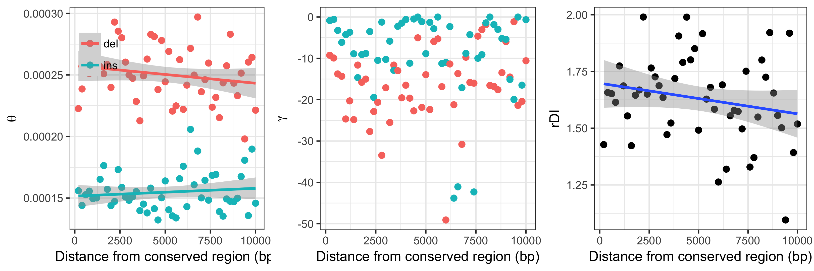
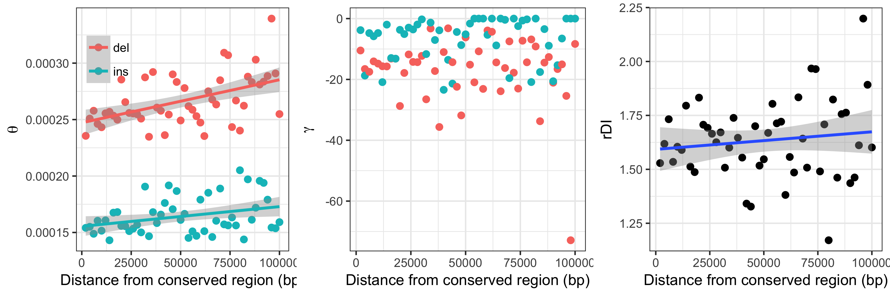

# Analysis of neutral INDEL data different distances from genes 

In order to investigate the possibility of linked selection influencing the ratio of insertions to deletions (rDI) in
regions of low recombination, INDELs where binned into a number of 50Kb windows according to gene distance.

## 200bp windows, up to 10kb 

### from CDS

```
$ mkdir distance_bin_beds_200bp_from_cds/
$ zcat /fastdata/bop15hjb/GT_ref/gt_noncoding.bed.gz | ./create_gene_proximity_bins.py -bin_size 200 -max_dist 10000 -out_prefix distance_bin_beds_200bp_noncoding/gt_noncoding_cds_proximity_200bpwindows
$ ls distance_bin_beds_200bp_from_cds/*bed.gz | python check_bin_population.py > distance_bin_beds_200bp_from_cds/bin_summaries_200bp_nc.txt
$ ls distance_bin_beds_200bp_from_cds/*bed.gz > distance_bin_beds_200bp_from_cds/200bp_bed_list.txt
$ ./proximity_anavar.py -vcf /fastdata/bop15hjb/GT_data/BGI_BWA_GATK/Analysis_ready_data/final/bgi_10birds.filtered_indels.pol.anno.recomb.line.vcf.gz -bed_list distance_bin_beds_200bp_from_cds/200bp_bed_list.txt -call_fa /fastdata/bop15hjb/GT_ref/bgi_10birds.callable.fa -dfe continuous -out_pre /fastdata/bop15hjb/GT_data/BGI_BWA_GATK/anavar_analysis/anavar_cds_distance_200bp_nc/gt_sel_ar_ref_cdsdist_200bp -sub -evolgen
$ ls /fastdata/bop15hjb/GT_data/BGI_BWA_GATK/anavar_analysis/anavar_cds_distance_200bp_nc/*results* | ../anavar_analyses/process_anavar_results.py -file_pattern bin,_bin\(\\d+-\?\\d\*\)\\. | cut -f 1-18 -d ',' > gt_nc_v_ar_200bp_wind_cds.results.csv
$ Rscript 200bp_window_plots_cds_dist.R 
```



| x (x vs distance) | Spearman's rho | p-value |
|:------------------|:--------------:|:-------:|
|ins_theta          | 0.01003601     | 0.9449  |
|del_theta          | -0.1764706     | 0.2195  |
|rdi                | -0.1848259     | 0.1982  |


## 2kb windows, up to 100kb 

### from CDS

```
$ mkdir distance_bin_beds_2kb_from_cds/
$ zcat /fastdata/bop15hjb/GT_ref/gt_noncoding.bed.gz | ./create_gene_proximity_bins.py -bin_size 2000 -max_dist 100000 -out_prefix distance_bin_beds_2kb_from_cds/gt_noncoding_cds_proximity_2kbwindows
$ ls distance_bin_beds_2kb_from_cds/*bed.gz | python check_bin_population.py > distance_bin_beds_2kb_from_cds/bin_summaries_2kb_nc.txt
$ ls distance_bin_beds_2kb_from_cds/*bed.gz > distance_bin_beds_2kb_from_cds/2kb_bed_list.txt
$ ./proximity_anavar.py -vcf /fastdata/bop15hjb/GT_data/BGI_BWA_GATK/Analysis_ready_data/final/bgi_10birds.filtered_indels.pol.anno.recomb.line.vcf.gz -bed_list distance_bin_beds_2kb_from_cds/2kb_bed_list.txt -call_fa /fastdata/bop15hjb/GT_ref/bgi_10birds.callable.fa -dfe continuous -out_pre /fastdata/bop15hjb/GT_data/BGI_BWA_GATK/anavar_analysis/anavar_cds_distance_2kb_nc/gt_sel_ar_ref_cdsdist_2kb -sub -evolgen
$ ls /fastdata/bop15hjb/GT_data/BGI_BWA_GATK/anavar_analysis/anavar_cds_distance_2kb_nc/*results* | ../anavar_analyses/process_anavar_results.py -file_pattern bin,_bin\(\\d+-\?\\d\*\)\\. | cut -f 1-18 -d ',' > gt_nc_v_ar_2kb_wind_cds.results.csv
$ Rscript 2kb_window_plots_cds_dist.R 
```



| x (x vs distance) | Spearman's rho | p-value |
|:------------------|:--------------:|:-------:|
|ins_theta          | 0.2842257      | 0.04581 |
|del_theta          | 0.4741897      | 0.0005822  |
|rdi                | 0.08052821     | 0.5772  |


### from UCNE

```
$ mkdir distance_bin_beds_2kb_from_UCNE/
$ zcat /fastdata/bop15hjb/GT_ref/gt_interUCNE.bed.gz | ./create_gene_proximity_bins.py -bin_size 2000 -max_dist 100000 -out_prefix distance_bin_beds_2kb_from_UCNE/gt_noncoding_UCNE_proximity_2kb_windows
$ ls distance_bin_beds_2kb_from_UCNE/*bed.gz > distance_bin_beds_2kb_from_UCNE/2kb_ucne_bed_list.txt
$ ./proximity_anavar.py -vcf /fastdata/bop15hjb/GT_data/BGI_BWA_GATK/Analysis_ready_data/final/bgi_10birds.filtered_indels.pol.anno.recomb.line.vcf.gz -bed_list distance_bin_beds_2kb_from_UCNE/2kb_ucne_bed_list.txt -call_fa /fastdata/bop15hjb/GT_ref/bgi_10birds.callable.fa -dfe continuous -out_pre /fastdata/bop15hjb/GT_data/BGI_BWA_GATK/anavar_analysis/anavar_UCNE_distance_2kb_nc/gt_sel_ar_ref_UCNEdist_2kb -sub -evolgen
```

## 20kb windows, up to 1Mb 

### from CDS

```
$ mkdir distance_bin_beds_20kb_from_cds/
$ zcat /fastdata/bop15hjb/GT_ref/gt_noncoding.bed.gz | ./create_gene_proximity_bins.py -bin_size 20000 -max_dist 1000000 -out_prefix distance_bin_beds_20kb_from_cds/gt_noncoding_cds_proximity_20kbwindows
$ ls distance_bin_beds_20kb_from_cds/*bed.gz | python check_bin_population.py > distance_bin_beds_20kb_from_cds/bin_summaries_20kb_nc.txt
$ ls distance_bin_beds_20kb_from_cds/*bed.gz > distance_bin_beds_20kb_from_cds/20kb_bed_list.tx
$ ./proximity_anavar.py -vcf /fastdata/bop15hjb/GT_data/BGI_BWA_GATK/Analysis_ready_data/final/bgi_10birds.filtered_indels.pol.anno.recomb.line.vcf.gz -bed_list distance_bin_beds_20kb_from_cds/20kb_bed_list.txt -call_fa /fastdata/bop15hjb/GT_ref/bgi_10birds.callable.fa -dfe continuous -out_pre /fastdata/bop15hjb/GT_data/BGI_BWA_GATK/anavar_analysis/anavar_cds_distance_20kb_nc/gt_sel_ar_ref_cdsdist_20kb -sub -evolgen

$ ls /fastdata/bop15hjb/GT_data/BGI_BWA_GATK/anavar_analysis/anavar_cds_distance_2kb_nc/*results* | ../anavar_analyses/process_anavar_results.py -file_pattern bin,_bin\(\\d+-\?\\d\*\)\\. | cut -f 1-18 -d ',' > gt_nc_v_ar_2kb_wind_cds.results.csv
$ Rscript 2kb_window_plots_cds_dist.R 
```