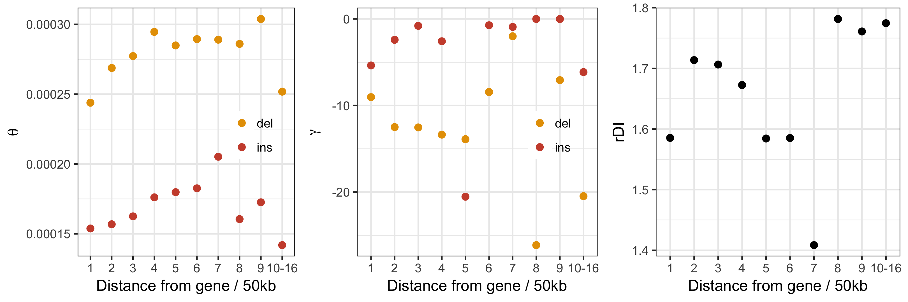

# Analysis of neutral INDEL data different distances from genes 

In order to investigate the possibility of linked selection influencing the ratio of insertions to deletions (rDI) in
regions of low recombination, INDELs where binned into a number of 50Kb windows according to gene distance.

## 50kb windows

```
$ cd ~/parus_indel/gene_proximity_analyses
$ mkdir distance_bin_beds
$ zcat /fastdata/bop15hjb/GT_ref/gt_intergenic.bed.gz | ./create_gene_proximity_bins.py -bin_size 50000 -out_prefix distance_bin_beds/gt_intergenic_gene_proximity_50kbwindows
$ ls distance_bin_beds/gt_intergenic_gene_proximity_50kbwindows.bin*.gz | python check_bin_population.py > distance_bin_beds/bin_summaries.txt
$ ls distance_bin_beds/*bed.gz | python clump_end_bins.py distance_bin_beds/bin_summaries.txt > distance_bin_beds/distance_bin_beds.txt
```

Anavar was then run for each of the distance bins:

```
$ ./proximity_anavar.py -vcf /fastdata/bop15hjb/GT_data/BGI_BWA_GATK/Analysis_ready_data/final/bgi_10birds.filtered_indels.pol.anno.recomb.line.vcf.gz -bed_list distance_bin_beds/distance_bin_beds.txt -call_fa /fastdata/bop15hjb/GT_data/BGI_BWA_GATK/Callable_sites/bgi_10birds.callable.fa -out_pre /fastdata/bop15hjb/GT_data/BGI_BWA_GATK/anavar_analysis/anavar_gene_distance/gt_sel_neu_ref_genedist
$ ls /fastdata/bop15hjb/GT_data/BGI_BWA_GATK/anavar_analysis/anavar_gene_distance/*results* | ../anavar_analyses/process_anavar_results.py -file_pattern bin,_bin\(\\d+-\?\\d\*\)\\. | cut -f 1-18 -d ',' > gt_sel_neu_ref_genedist.results.csv
$ Rscript proximity_plots.R
```



## 1kb windows

```
$ mkdir distance_bin_beds_1kb
```