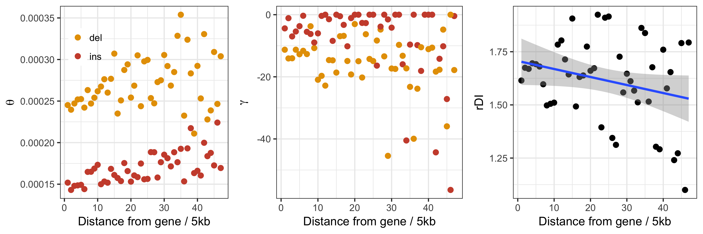
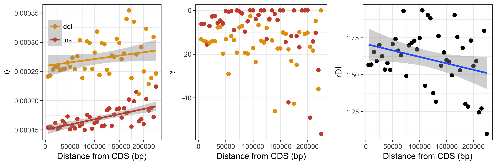
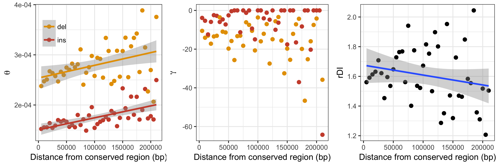
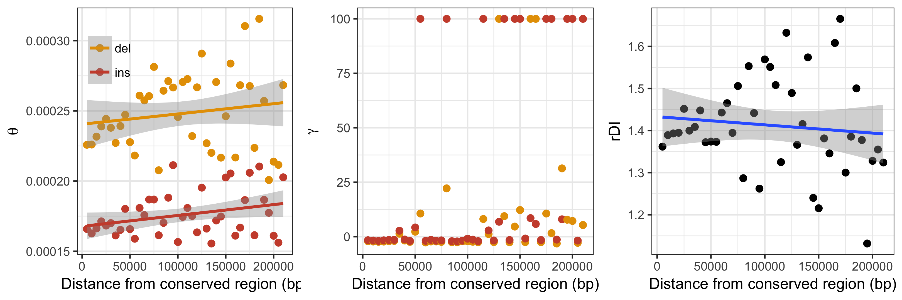
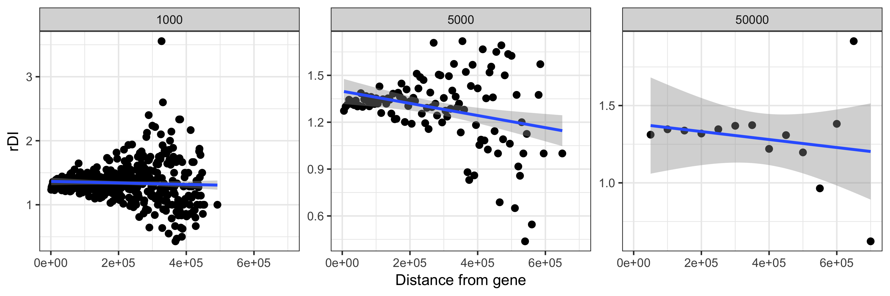

# Analysis of neutral INDEL data different distances from genes 

In order to investigate the possibility of linked selection influencing the ratio of insertions to deletions (rDI) in
regions of low recombination, INDELs where binned into a number of 50Kb windows according to gene distance.

## 50kb windows

```
$ cd ~/parus_indel/gene_proximity_analyses
$ mkdir distance_bin_beds
$ zcat /fastdata/bop15hjb/GT_ref/gt_intergenic.bed.gz | ./create_gene_proximity_bins.py -bin_size 50000 -out_prefix distance_bin_beds/gt_intergenic_gene_proximity_50kbwindows
$ ls distance_bin_beds/gt_intergenic_gene_proximity_50kbwindows.bin*.gz | python check_bin_population.py > distance_bin_beds/bin_summaries.txt
$ ls distance_bin_beds/*bed.gz | python clump_end_bins.py distance_bin_beds/bin_summaries.txt > distance_bin_beds/distance_bin_beds.txt
```

Anavar was then run for each of the distance bins:

```
$ ./proximity_anavar.py -vcf /fastdata/bop15hjb/GT_data/BGI_BWA_GATK/Analysis_ready_data/final/bgi_10birds.filtered_indels.pol.anno.recomb.line.vcf.gz -bed_list distance_bin_beds/distance_bin_beds.txt -call_fa /fastdata/bop15hjb/GT_data/BGI_BWA_GATK/Callable_sites/bgi_10birds.callable.fa -out_pre /fastdata/bop15hjb/GT_data/BGI_BWA_GATK/anavar_analysis/anavar_gene_distance/gt_sel_neu_ref_genedist
$ ls /fastdata/bop15hjb/GT_data/BGI_BWA_GATK/anavar_analysis/anavar_gene_distance/*results* | ../anavar_analyses/process_anavar_results.py -file_pattern bin,_bin\(\\d+-\?\\d\*\)\\. | cut -f 1-18 -d ',' > gt_sel_neu_ref_genedist.results.csv
$ Rscript proximity_plots.R gt_sel_neu_ref_genedist.results.csv distance_estimates.png 
```


## 5kb windows

```
$ mkdir distance_bin_beds_5kb
$ zcat /fastdata/bop15hjb/GT_ref/gt_intergenic.bed.gz | ./create_gene_proximity_bins.py -bin_size 5000 -out_prefix distance_bin_beds_5kb/gt_intergenic_gene_proximity_5kbwindows
$ ls distance_bin_beds/gt_intergenic_gene_proximity_5kbwindows.bin*.gz | python check_bin_population.py > distance_bin_beds_5kb/bin_summaries_5kb.txt
$ ls distance_bin_beds_5kb/*bed.gz | python clump_end_bins.py distance_bin_beds_5kb/bin_summaries_5kb.txt > distance_bin_beds_5kb/distance_bin_beds_5kb.txt
$ ./proximity_anavar.py -vcf /fastdata/bop15hjb/GT_data/BGI_BWA_GATK/Analysis_ready_data/final/bgi_10birds.filtered_indels.pol.anno.recomb.line.vcf.gz -bed_list distance_bin_beds_5kb/distance_bin_beds_5kb.txt -call_fa /fastdata/bop15hjb/GT_data/BGI_BWA_GATK/Callable_sites/bgi_10birds.callable.fa -out_pre /fastdata/bop15hjb/GT_data/BGI_BWA_GATK/anavar_analysis/anavar_gene_distance_5kb/gt_sel_neu_ref_genedist_5kb -sub
$ ls /fastdata/bop15hjb/GT_data/BGI_BWA_GATK/anavar_analysis/anavar_gene_distance_5kb/*results* | ../anavar_analyses/process_anavar_results.py -file_pattern bin,_bin\(\\d+-\?\\d\*\)\\. | cut -f 1-18 -d ',' > gt_sel_neu_ref_genedist_5kb.results.csv
$ Rscript proximity_plots_5kb.R 
```



## 1kb windows

```
$ mkdir distance_bin_beds_1kb
$ zcat /fastdata/bop15hjb/GT_ref/gt_intergenic.bed.gz | ./create_gene_proximity_bins.py -bin_size 1000 -out_prefix distance_bin_beds_1kb/gt_intergenic_gene_proximity_1kbwindows
$ ls distance_bin_beds_1kb/gt_intergenic_gene_proximity_1kbwindows.bin*.gz | python check_bin_population.py > distance_bin_beds_1kb/bin_summaries_1kb.txt
$ ls distance_bin_beds_1kb/*bed.gz | python clump_end_bins.py distance_bin_beds_1kb/bin_summaries_1kb.txt > distance_bin_beds_1kb/distance_bin_beds_1kb.txt
```

This window size was not run through the model due to lack of data in many bins.

## all non-coding data (5kb) - more power to the model

To increase the indel content of our proximity bins we included intronic data along with intergenic data. We used this
data following our 5kb window approach.

```
$ mkdir distance_bin_beds_5kb_noncoding
$ zcat /fastdata/bop15hjb/GT_ref/gt_noncoding.bed.gz | ./create_gene_proximity_bins.py -bin_size 5000 -out_prefix distance_bin_beds_5kb_noncoding/gt_noncoding_cds_proximity_5kbwindows
$ ls distance_bin_beds_5kb_noncoding/*.bed.gz | python check_bin_population.py > distance_bin_beds_5kb_noncoding/bin_summaries_5kb_nc.txt
$ ls distance_bin_beds_5kb_noncoding/*bed.gz | python clump_end_bins.py distance_bin_beds_5kb_noncoding/bin_summaries_5kb_nc.txt > distance_bin_beds_5kb_noncoding/distance_bin_beds_5kb_nc.txt
$ ./proximity_anavar.py -vcf /fastdata/bop15hjb/GT_data/BGI_BWA_GATK/Analysis_ready_data/final/bgi_10birds.filtered_indels.pol.anno.recomb.line.vcf.gz -bed_list distance_bin_beds_5kb_noncoding/distance_bin_beds_5kb_nc.txt -call_fa /fastdata/bop15hjb/GT_data/BGI_BWA_GATK/Callable_sites/bgi_10birds.callable.fa -out_pre /fastdata/bop15hjb/GT_data/BGI_BWA_GATK/anavar_analysis/anavar_cds_distance_5kb_nc/gt_sel_neu_ref_cdsdist_5kb -sub
$ ls /fastdata/bop15hjb/GT_data/BGI_BWA_GATK/anavar_analysis/anavar_cds_distance_5kb_nc/*results* | ../anavar_analyses/process_anavar_results.py -file_pattern bin,_bin\(\\d+-\?\\d\*\)\\. | cut -f 1-18 -d ',' > gt_sel_neu_ref_cdsdist_5kb.results.csv 
$ Rscript proximity_plots_5kb_nc.R 
```



## all non-coding data (5kb) and distance from genes **OR** UCNE

### continuous model

```
$ mkdir distance_bin_beds_5kb_noncoding_UCNE
$ zcat /fastdata/bop15hjb/GT_ref/gt_noncoding_withoutUCNE.bed.gz | ./create_gene_proximity_bins.py -bin_size 5000 -out_prefix distance_bin_beds_5kb_noncoding_UCNE/gt_noncoding_conserved_region_proximity_5kbwindows
$ ls distance_bin_beds_5kb_noncoding_UCNE/*.bed.gz | python check_bin_population.py > distance_bin_beds_5kb_noncoding_UCNE/bin_summaries_5kb_nc_UCNE.txt
$ ls distance_bin_beds_5kb_noncoding_UCNE/*bed.gz | python clump_end_bins.py distance_bin_beds_5kb_noncoding_UCNE/bin_summaries_5kb_nc_UCNE.txt > distance_bin_beds_5kb_noncoding_UCNE/distance_bin_beds_5kb_nc_UCNE.txt
$ ./proximity_anavar.py -vcf /fastdata/bop15hjb/GT_data/BGI_BWA_GATK/Analysis_ready_data/final/bgi_10birds.filtered_indels.pol.anno.recomb.line.vcf.gz -bed_list distance_bin_beds_5kb_noncoding_UCNE/distance_bin_beds_5kb_nc_UCNE.txt -call_fa /fastdata/bop15hjb/GT_data/BGI_BWA_GATK/Callable_sites/bgi_10birds.callable.fa -out_pre /fastdata/bop15hjb/GT_data/BGI_BWA_GATK/anavar_analysis/anavar_cds_distance_5kb_nc_UCNE/gt_sel_neu_ref_conserveddist_5kb -sub -evolgen
$ ls /fastdata/bop15hjb/GT_data/BGI_BWA_GATK/anavar_analysis/anavar_cds_distance_5kb_nc_UCNE/*results* | ../anavar_analyses/process_anavar_results.py -file_pattern bin,_bin\(\\d+-\?\\d\*\)\\. | cut -f 1-18 -d ',' > gt_sel_neu_ref_conserveddist_5kb.results.csv
$ Rscript proximity_plots_5kb_nc_UCNE.R 
```



Stats:

```
       Spearman's rank correlation rho

data:  as.numeric(ins_theta$ins_theta) and ins_theta$distance
S = 3626, p-value = 5.721e-07
alternative hypothesis: true rho is not equal to 0
sample estimates:
      rho 
0.7061826 


        Spearman's rank correlation rho

data:  as.numeric(del_theta$del_theta) and del_theta$distance
S = 8008, p-value = 0.02315
alternative hypothesis: true rho is not equal to 0
sample estimates:
      rho 
0.3511061 


        Spearman's rank correlation rho

data:  as.numeric(rdi_data$rdi) and as.numeric(rdi_data$bin)
S = 15690, p-value = 0.08233
alternative hypothesis: true rho is not equal to 0
sample estimates:
       rho 
-0.2713718 

```

### discrete model

```
$ ./proximity_anavar.py -vcf /fastdata/bop15hjb/GT_data/BGI_BWA_GATK/Analysis_ready_data/final/bgi_10birds.filtered_indels.pol.anno.recomb.line.vcf.gz -bed_list distance_bin_beds_5kb_noncoding_UCNE/distance_bin_beds_5kb_nc_UCNE.txt -call_fa /fastdata/bop15hjb/GT_data/BGI_BWA_GATK/Callable_sites/bgi_10birds.callable.fa -out_pre /fastdata/bop15hjb/GT_data/BGI_BWA_GATK/anavar_analysis/anavar_cds_distance_5kb_nc_UCNE_discrete/gt_sel_neu_ref_conserveddistdiscrete_5kb -dfe discrete -sub -evolgen
$ ls /fastdata/bop15hjb/GT_data/BGI_BWA_GATK/anavar_analysis/anavar_cds_distance_5kb_nc_UCNE_discrete/*results* | ../anavar_analyses/process_anavar_results.py -file_pattern bin,_bin\(\\d+-\?\\d\*\)\\. | cut -f 1-18 -d ','  > gt_sel_neu_ref_conserveddist_discrete_5kb.results.csv
$ Rscript proximity_plots_5kb_nc_UCNE_discrete.R 
```



Stats:

```
        Spearman's rank correlation rho

data:  as.numeric(ins_theta$ins_theta) and ins_theta$distance
S = 9830, p-value = 0.1956
alternative hypothesis: true rho is not equal to 0
sample estimates:
      rho 
0.2034681 


        Spearman's rank correlation rho

data:  as.numeric(del_theta$del_theta) and del_theta$distance
S = 11002, p-value = 0.4927
alternative hypothesis: true rho is not equal to 0
sample estimates:
      rho 
0.1085001 


        Spearman's rank correlation rho

data:  as.numeric(rdi_data$rdi) and as.numeric(rdi_data$bin)
S = 14668, p-value = 0.2309
alternative hypothesis: true rho is not equal to 0
sample estimates:
       rho 
-0.1885585 
```

## all non-coding data (500bp) and distance from genes **OR** UCNE

```
$ mkdir distance_bin_beds_500bp_noncoding_UCNE/
$ zcat /fastdata/bop15hjb/GT_ref/gt_noncoding_withoutUCNE.bed.gz | ./create_gene_proximity_bins.py -bin_size 500 -out_prefix distance_bin_beds_500bp_noncoding_UCNE/gt_noncoding_conserved_region_proximity_500bpwindows
$ ls distance_bin_beds_500bp_noncoding_UCNE/*.bed.gz | python check_bin_population.py > distance_bin_beds_500bp_noncoding_UCNE/bin_summaries_500bp_nc_UCNE.txt
$ ls distance_bin_beds_500bp_noncoding_UCNE/*bed.gz | python clump_end_bins.py distance_bin_beds_500bp_noncoding_UCNE/bin_summaries_500bp_nc_UCNE.txt > distance_bin_beds_500bp_noncoding_UCNE/distance_bin_beds_500bp_nc_UCNE.txt
$ ./proximity_anavar.py -vcf /fastdata/bop15hjb/GT_data/BGI_BWA_GATK/Analysis_ready_data/final/bgi_10birds.filtered_indels.pol.anno.recomb.line.vcf.gz -bed_list distance_bin_beds_500bp_noncoding_UCNE/distance_bin_beds_500bp_nc_UCNE.txt -call_fa /fastdata/bop15hjb/GT_data/BGI_BWA_GATK/Callable_sites/bgi_10birds.callable.fa -out_pre /fastdata/bop15hjb/GT_data/BGI_BWA_GATK/anavar_analysis/anavar_cds_distance_500bp_nc_UCNE/gt_sel_neu_ref_conserveddist_500bp -sub -evolgen
$ ls /fastdata/bop15hjb/GT_data/BGI_BWA_GATK/anavar_analysis/anavar_cds_distance_500bp_nc_UCNE/*results* | ../anavar_analyses/process_anavar_results.py -file_pattern bin,_bin\(\\d+-\?\\d\*\)\\. | cut -f 1-18 -d ',' > gt_sel_neu_ref_conserveddist_500bp.results.csv
$ Rscript proximity_plots_500bp_nc_UCNE.R 
```


Stats:

```
        Spearman's rank correlation rho

data:  as.numeric(ins_theta$ins_theta) and ins_theta$distance
S = 234870, p-value = 0.0001703
alternative hypothesis: true rho is not equal to 0
sample estimates:
      rho 
0.3279848 


        Spearman's rank correlation rho

data:  as.numeric(del_theta$del_theta) and del_theta$distance
S = 231770, p-value = 0.0001106
alternative hypothesis: true rho is not equal to 0
sample estimates:
      rho 
0.3368717 


        Spearman's rank correlation rho

data:  as.numeric(rdi_data$rdi) and as.numeric(rdi_data$bin)
S = 334470, p-value = 0.6294
alternative hypothesis: true rho is not equal to 0
sample estimates:
      rho 
0.0430038 
```

## rDI summary for different windows

```
$ Rscript rdi_gene_dist.R
```

