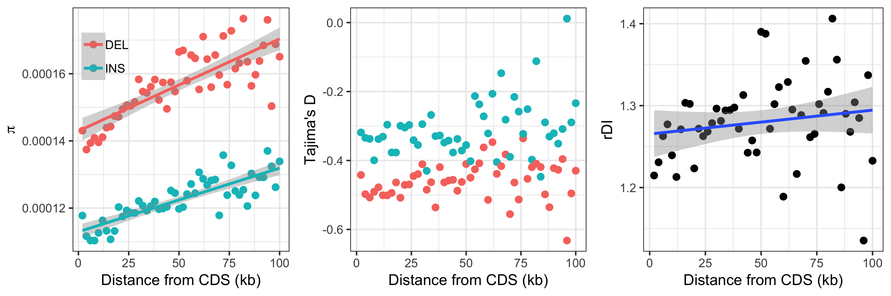

# Analysis of neutral INDEL data different distances from genes 

In order to investigate the possibility of linked selection influencing the ratio of insertions to deletions (rDI) in
regions of low recombination, INDELs where binned into a number of 50Kb windows according to gene distance.


## 2kb windows, up to 100kb 

### continuous model

```
$ mkdir distance_bin_beds_2kb_from_cds/
$ zcat /fastdata/bop15hjb/GT_ref/gt_noncoding.bed.gz | ./create_gene_proximity_bins.py -bin_size 2000 -max_dist 100000 -out_prefix distance_bin_beds_2kb_from_cds/gt_noncoding_cds_proximity_2kbwindows
$ ls distance_bin_beds_2kb_from_cds/*bed.gz | python check_bin_population.py > distance_bin_beds_2kb_from_cds/bin_summaries_2kb_nc.txt
$ ls distance_bin_beds_2kb_from_cds/*bed.gz > distance_bin_beds_2kb_from_cds/2kb_bed_list.txt
$ ./proximity_anavar.py -vcf /fastdata/bop15hjb/GT_data/BGI_BWA_GATK/Analysis_ready_data/final/bgi_10birds.filtered_indels.pol.anno.recomb.line.vcf.gz -bed_list distance_bin_beds_2kb_from_cds/2kb_bed_list.txt -call_fa /fastdata/bop15hjb/GT_ref/bgi_10birds.callable.fa -dfe continuous -out_pre /fastdata/bop15hjb/GT_data/BGI_BWA_GATK/anavar_analysis/anavar_cds_distance_2kb_nc/gt_sel_ar_ref_cdsdist_2kb -sub -evolgen
$ ls /fastdata/bop15hjb/GT_data/BGI_BWA_GATK/anavar_analysis/anavar_cds_distance_2kb_nc/*results* | ../anavar_analyses/process_anavar_results.py -file_pattern bin,_bin\(\\d+-\?\\d\*\)\\. | cut -f 1-18 -d ',' > gt_nc_v_ar_2kb_wind_cds.results.csv
$ Rscript window_plots.R gt_nc_v_ar_2kb_wind_cds.results.csv 2kb_nc_cds_dist.png 2000
```


| x (x vs distance) | Spearman's rho | p-value |
|:------------------|:--------------:|:-------:|
|ins_theta          | 0.2842257      | 0.04581 |
|del_theta          | 0.4741897      | 0.0005822  |
|rdi                | 0.08052821     | 0.5772  |

We also assessed how much of this was from neutral variation and how much deleterious.

```bash
python linked_dfe.py -res_csv gt_nc_v_ar_2kb_wind_cds.results.csv > nc_dfe_exon_dist.txt
Rscript exon_dist_dfe.R
```

Results: [theta plot](nc_exons_dist_dfe_theta.pdf), [proportion plot](nc_exons_dist_dfe_prop.pdf)

### summary stats

```bash
mkdir distance_bin_beds_2kb_from_cds_withsfs/
ls $PWD/distance_bin_beds_2kb_from_cds/*gz | while read i; do ls $i | cut -d '.' -f 2 | tr '\n' '\t'; echo $i; done > 2kb_binids_beds.txt
../summary_analyses/automate_bed_summary.py -indel_vcf /fastdata/bop15hjb/h_j_b/GT_data/BGI_BWA_GATK/Analysis_ready_data/final/bgi_10birds.filtered_indels.pol.anno.recomb.line.vcf.gz -snp_vcf /fastdata/bop15hjb/h_j_b/GT_data/BGI_BWA_GATK/Analysis_ready_data/final/bgi_10birds.filtered_snps.pol.anno.degen.line.vcf.gz -region_list 2kb_binids_beds.txt -out_pre distance_bin_beds_2kb_from_cds/gt_prox_summary_raw -evolgen
../summary_analyses/automate_bed_summary.py -indel_vcf /fastdata/bop15hjb/h_j_b/GT_data/BGI_BWA_GATK/Analysis_ready_data/final/bgi_10birds.filtered_indels.pol.anno.recomb.line.vcf.gz -snp_vcf /fastdata/bop15hjb/h_j_b/GT_data/BGI_BWA_GATK/Analysis_ready_data/final/bgi_10birds.filtered_snps.pol.anno.degen.line.vcf.gz -region_list 2kb_binids_beds.txt -correct_sfs -out_pre distance_bin_beds_2kb_from_cds_withsfs/gt_prox_summary -evolgen
../summary_analyses/automate_bed_callable.py -call_fa /fastdata/bop15hjb/GT_ref/bgi_10birds.callable.fa -chr_list /fastdata/bop15hjb/GT_ref/gt_autosomes.txt -region_list 2kb_binids_beds.txt -out_pre distance_bin_beds_2kb_from_cds_withsfs/gt_prox_call

cd distance_bin_beds_2kb_from_cds_withsfs/

head -n 1 gt_prox_summary_bin1_stats.txt > gt_prox_summary_stats.txt 
cat gt_prox_summary_bin*_stats.txt | grep -v cat | sort -n -k1.4 >> gt_prox_summary_stats.txt
cp gt_prox_summary_stats.txt ../

head -n 1 gt_prox_call_bin1.txt > gt_prox_call.txt 
cat gt_prox_call*.txt | grep -v cat | sort -n -k1.4 >> gt_prox_call.txt 
cp gt_prox_call.txt ../

cd distance_bin_beds_2kb_from_cds/

head -n 1 gt_prox_summary_raw_bin1_stats.txt > gt_prox_summary_stats_raw.txt 
cat gt_prox_summary_raw_bin*_stats.txt | grep -v cat | sort -n -k1.4 >> gt_prox_summary_stats_raw.txt
cp gt_prox_summary_stats_raw.txt ../


cd ..
Rscript window_plots_sum_stats.R
```



| x (x vs distance) | Spearman's rho | p-value |
|:------------------|:--------------:|:-------:|
|ins_theta          | 0.8410564      | 2.2e-16 |
|del_theta          | 0.7878511      | 2.2e-16 |

### Looking at how far the relationship persists

```bash
Rscript correlation_power.R 
```

Plot [here](theta_cor_power.pdf).

