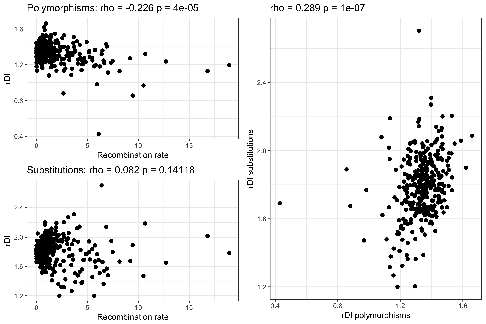
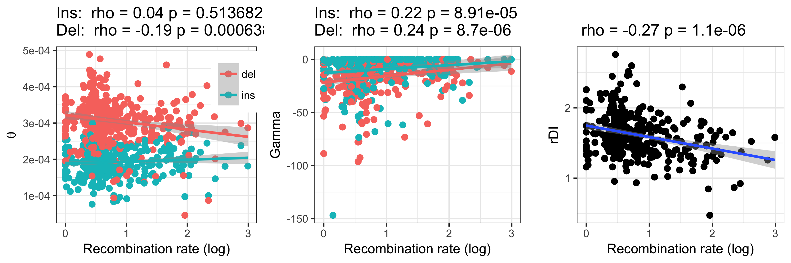

## Recombination window analysis

2Mb window coordinates were generated and mean recombination rates were calculated per window using scripts from the biased gene conversion project. Windows without recombination rate estimates and with less than 500 polarisable INDELs were excluded.

```
$ qsub prepare_windows.sh
$ cd ~/parus_indel/anavar_analyses
$ python consolidate_window_info.py > all_2Mb_windows.txt
$ python filter_windows.py
$ ./add_window_indel_subs.py -windows filtered_2Mb_windows.txt -wga_bed /fastdata/bop15hjb/bird_alignments/UCSC_pipeline/multiple_zhang_param/Zebrafinch.Flycatcher.Greattit.wga.bed.gz > filtered_2Mb_windows_with_subs.txt
```

The relationship between recombination rate and the ratio of deletions to insertions (rDI) was tested and plotted:

```
$ Rscript window_rdi.R
```



Additionally the relationship between theta and recombination rate and Tajima's D and recombination was explored for both insertions and deletions.

```
$ Rscript window_summary.R
```


Anavar was then run on each window, with a continuous gamma model (both the full model and the reduced, equal theta model) and a discrete 1 class gamma model:

```
$ ~/parus_indel/anavar_analyses/window_sel_vs_neu_anavar.py -vcf /fastdata/bop15hjb/GT_data/BGI_BWA_GATK/Analysis_ready_data/final/bgi_10birds.filtered_indels.pol.anno.recomb.line.vcf.gz -windows ~/parus_indel/anavar_analyses/filtered_2Mb_windows.txt -call_fa /fastdata/bop15hjb/GT_data/BGI_BWA_GATK/Callable_sites/bgi_10birds.callable.fa -noncoding_bed /fastdata/bop15hjb/GT_ref/gt_noncoding.bed.gz -out_pre /fastdata/bop15hjb/GT_data/BGI_BWA_GATK/anavar_analysis/window_analysis/gt_window_anavar -evolgen
$ ~/parus_indel/anavar_analyses/window_sel_vs_neu_anavar.py -vcf /fastdata/bop15hjb/GT_data/BGI_BWA_GATK/Analysis_ready_data/final/bgi_10birds.filtered_indels.pol.anno.recomb.line.vcf.gz -windows ~/parus_indel/anavar_analyses/filtered_2Mb_windows.txt -call_fa /fastdata/bop15hjb/GT_data/BGI_BWA_GATK/Callable_sites/bgi_10birds.callable.fa -noncoding_bed /fastdata/bop15hjb/GT_ref/gt_noncoding.bed.gz -out_pre /fastdata/bop15hjb/GT_data/BGI_BWA_GATK/anavar_analysis/window_analysis_equal_t/gt_window_anavar_equal_t -equal_theta -evolgen
$ ~/parus_indel/anavar_analyses/window_sel_vs_neu_anavar.py -vcf /fastdata/bop15hjb/GT_data/BGI_BWA_GATK/Analysis_ready_data/final/bgi_10birds.filtered_indels.pol.anno.recomb.line.vcf.gz -windows ~/parus_indel/anavar_analyses/filtered_2Mb_windows.txt -call_fa /fastdata/bop15hjb/GT_data/BGI_BWA_GATK/Callable_sites/bgi_10birds.callable.fa -noncoding_bed /fastdata/bop15hjb/GT_ref/gt_noncoding.bed.gz -out_pre /fastdata/bop15hjb/GT_data/BGI_BWA_GATK/anavar_analysis/window_analysis_discrete/gt_window_anavar_discrete -evolgen -dfe discrete
$ cd ~/parus_indel/anavar_analyses
$ ls /fastdata/bop15hjb/GT_data/BGI_BWA_GATK/anavar_analysis/window_analysis/*results.txt | ./process_anavar_results.py -file_pattern window,_window\(\\d+\)\\. | cut -d ',' -f 1-18 > gt_windows_noncoding_continuous_full_results.csv
$ ls /fastdata/bop15hjb/GT_data/BGI_BWA_GATK/anavar_analysis/window_analysis_discrete/*results.txt | ./process_anavar_results.py -file_pattern window,_window\(\\d+\)\\. | cut -d ',' -f 1-18 > gt_windows_noncoding_discrete_full_results.csv 
# removed empty results file
$ rm /fastdata/bop15hjb/GT_data/BGI_BWA_GATK/anavar_analysis/window_analysis_equal_t/gt_window_anavar_equal_t_window179.results.txt
$ ls /fastdata/bop15hjb/GT_data/BGI_BWA_GATK/anavar_analysis/window_analysis_equal_t/*results.txt | ./process_anavar_results.py -file_pattern window,_window\(\\d+\)\\. | cut -d ',' -f 1-18 > gt_windows_noncoding_continuous_equal_t_results.csv
$ ./compile_recomb_window_res.py -results gt_windows_noncoding_continuous_full_results.csv -windows filtered_2Mb_windows.txt > gt_windows_noncoding_continuous_full_results.windowdata.csv
$ ./compile_recomb_window_res.py -results gt_windows_noncoding_discrete_full_results.csv -windows filtered_2Mb_windows.txt > gt_windows_noncoding_discrete_full_results.windowdata.csv
$ ./compile_recomb_window_res.py -results gt_windows_noncoding_continuous_equal_t_results.csv -windows filtered_2Mb_windows.txt > gt_windows_noncoding_continuous_equal_t_results.windowdata.csv
$ Rscript window_anavar.R
$ Rscript window_anavar_discrete.R
$ Rscript window_anavar_equal_t.R 
```




Reduced model results [here](continuous_window_anavar_equal_t.png).
Discrete model results [here](discrete_window_anavar.png).