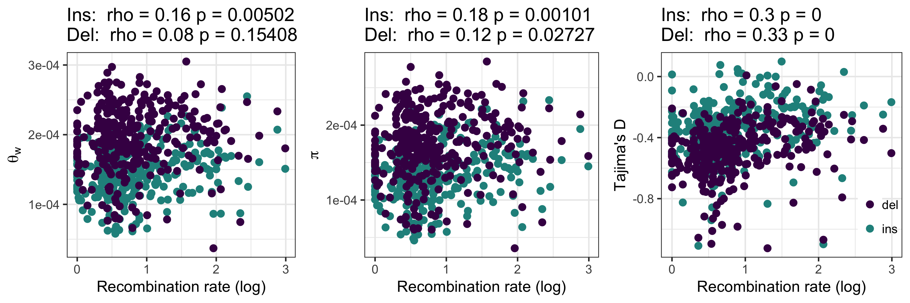

## Recombination window analysis

2Mb window coordinates were generated and mean recombination rates were calculated per window using scripts from the biased gene conversion project. Windows without recombination rate estimates and with less than 500 polarisable INDELs were excluded.

```
$ qsub prepare_windows.sh
$ cd ~/parus_indel/recombination_analyses/
$ python consolidate_window_info.py > all_2Mb_windows.txt
$ python filter_windows.py
$ ./add_window_indel_subs.py -windows filtered_2Mb_windows.txt -wga_bed /fastdata/bop15hjb/bird_alignments/UCSC_pipeline/multiple_zhang_param/Zebrafinch.Flycatcher.Greattit.wga.bed.gz > filtered_2Mb_windows_with_subs.txt
```

The relationship between theta and recombination rate and Tajima's D and recombination was explored for both insertions and deletions.

```
$ Rscript window_summary.R
```



As well as for INDEL divergence and recombination.

