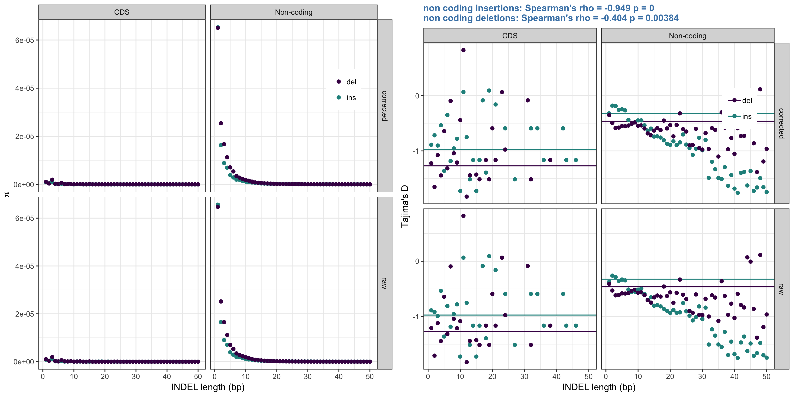

# Reviewer comments

## Reviewer 1

1. It would be interesting to know if there is any correlation between indel pi, Tajima’s D and indel length, 
both in non-coding and coding DNA.

- [x] easy enough to do
- [x] but pi will negatively correlated, Tajima's D would be more interesting

2. They estimate very high values of alpha, yet they also show that Tajima’s D is negative which is 
consistent with population size expansion; it is therefore possible that the high alpha values are simply 
a consequence of biases in the MK-methods to estimate alpha. This should be discussed.

- [ ] Kai?

3. They use parsimony to orient their indels; this is likely biased and I was wondering whether correcting 
their data using their estimates of orientation errors might be something to explore.

- [ ] assume they mean correct the actual variant polarisation?
- [ ] sounds interesting but potentially a lot of work?

4. They estimate alpha for coding sequences but not the non-coding sequences. It would be interesting to see 
these reported for the non-coding DNA.

- [ ] estimate for non-coding, think they were negative when I looked at it before?
- [ ] deletions: -0.230122722427 insertions: -10.1324551346 (2 class equal t model)

5. When the Tajima’s D analyses are first mentioned there is no reference to figure 2.

- [ ] refer to

6. The best fit DFE for coding sequences is bimodal, and for non-coding DNA its gamma – is this simply a 
consequence of sample size or because there are so few coding indels that you have little information about the DFE?

- [ ] so few INDELs probably, but gamma dist says same thing really? CDS indels are bad.
- [ ] actually seems to be to do with equal t assumption, if assume then get 2 class best, if not the continuous...

7. The authors give a histogram of the distribution of indel lengths but this is not referred to in the results 
section.

- [ ] refer to 

## Reviewer 2

MAJOR COMMENTS

1. Higher calling error rates in AR may inflate divergence and diversity (Table 1) and divergence (Fig. 1b), 
concerning as ARs are used as the neutral reference, If calling errors cannot be tested, this should 
probably be at least acknowledged.

- [ ] best way would be to do some PCR validation of INDELs in AR and Non-coding regions, but not practical
- [ ] could look at ratios of SNP divergence and diversity between AR and non coding and see if the 
diversity and divergence increase is proportional to that for INDELs and if so argue that SNPs should be less 
affected by repetitive regions so if INDELs show similar trend, maybe not such a problem?
- [ ] could run anavar using SSWW NC snps as neutral reference, but no mutation accumulation experiments to go on? 
range of values like MBE paper?
- [ ] could do nothing and just acknowledge it

2. Split the CDS indels into those with lengths in multiple of 3 and those that are not

- [ ] separate out, enough power for anavar?

3. P14Col2L7: in addition to linked selection, elevated diversity at sites of high recombination may also be caused by the mutagenic effect of recombination. These two can be disentangled by comparing within-species vs. between-species comparisons.

- [x] contrast polymorphism diversity and divergence with recomb?
- [ ] don't see how it solves the problem, couldn't it still be caused by both, maybe I'm misunderstanding?

MINOR COMMENTS

1. P4Col2L12: where the insertions with just one matching breakpoint included in “multiallelic sites”? Please explain.

- [ ] Yes only variations with matching breakpoints were retained 
- [ ] also a cause for being unable not to polarise a large amount of INDELs

2. P5Col2L14: the original definition of \pi by Tajima (1983) is based on the "average number of nucleotide differences", and this is ambiguous for indels. It would help to specify more exactly what is meant.

- [ ] Clarify pi for indels - doesn't account for length

3. P8Col1L8: what’s “stringent” about the parsimony-based approach? Isn’t this the usual 3-species parsimony?

- [ ] Delete stringent?

4. P8Col1L11-13: it follows that ~50% of indels could not be polarized. Why? It would help to have a supplementary table with a breakdown of what happened (no alignment with the other species, non-parsimonious distribution of indels across species, multiple overlapping indels, etc.). I am also concerned that the polarizable indels form a biased subset of all indels, perhaps more conservative, and that the fraction of indels that could be polarized (and where therefore used in downstream analyses) differed between compared classes (e.g., AR vs. intergenic in Fig. 1a).

- [x] produce summary figure for polarisation success in the different regions
- [ ] AR bit complicated as identified from genome alignment so pol will be different
- [ ] Very hard to compare AR in a meaningful way to rest as 'not-aligned' and 'low coverage' as causes for polarisation failure do not exist due to the way ARs were identified.

5. (A suggestion rather than a concern, and should not affect the chances of acceptance): since the authors have divergence data, can they compare their estimates of \alpha with those obtained with a MacDonald-Kreitman like approach?

- [ ] do we want to do this?

6. P12Col2L8: a word is missing, perhaps “results” or “findings”

- [ ] add one of the above
