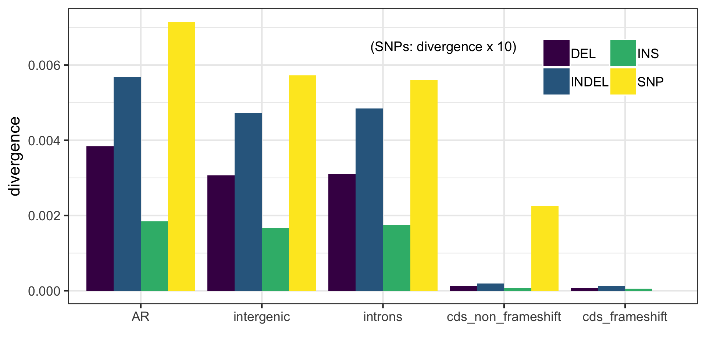

# Performing the INDEL analysis

## Repeat region analysis

The occurance of INDELs in repeat regions was investigated using GATK's 'VariantAnnotator' to annotate homoploymer runs and tandem repeats in the INDEL dataset. This used a python wrapper as follows:

```
python annotate_hr_tr.py -vcf /fastdata/bop15hjb/GT_data/BGI_BWA_GATK/Analysis_ready_data/bgi_10birds.raw.snps.indels.all_sites.rawindels.recalibrated.filtered_t99.0.pass.maxlength50.biallelic.coveragefiltered.pass.repeatfilter.pass.vcf -ref /fastdata/bop15hjb/GT_ref/Parus_major_1.04.rename.fa -out /fastdata/bop15hjb/GT_data/BGI_BWA_GATK/Repeat_analysis/
```
Summary data was the generated using the script ```indel_repeat_stats.py``` as follows:

```
python indel_repeat_stats.py -vcf /fastdata/bop15hjb/GT_data/BGI_BWA_GATK/Repeat_analysis/bgi_10birds.raw.snps.indels.all_sites.rawindels.recalibrated.filtered_t99.0.pass.maxlength50.biallelic.coveragefiltered.pass.repeatfilter.pass.hr.tr.vcf
```

This yielded the following results:

|Class	          |Number of INDELs|
|:----------------|:--------------:|
|Hompolymer runs	|241528          |
|Tandem repeats	  |668234          |
|Overlap	        |241528          |
|Total repetative	|668234          |
|Total no. INDELs	|1240366         | 
|% INDEL in repeat|53              |


## pi theta_w and Tajima's D

Fasta files of callable sites were created and summarised using the following codes:

| Case            | code  |
|:----------------|:-----:|
| N               | 0     |
| Filtered        | 1     |
| Pass polarised  | K     |
| Pass unpolarised| k     |
| AR polarised    | R     |
| AR unpolarised  | r     |

```
$ ~/parus_indel/summary_analyses/callable_sites_parallel.py -vcf /fastdata/bop15hjb/GT_data/BGI_BWA_GATK/bgi_10birds.raw.snps.indels.all_sites.vcf.bgz -bed /fastdata/bop15hjb/GT_ref/ParusMajorBuild1_v24032014_reps.bed -ar_bed /fastdata/bop15hjb/GT_ref/Greattit.Zebrafinch.Flycatcher.ancLINEs.sorted.bed.gz -chr_bed /fastdata/bop15hjb/GT_ref/chromosome_list.bed -pol /fastdata/bop15hjb/GT_ref/Greattit.Zebrafinch.Flycatcher.wga.bed.gz -out_pre /fastdata/bop15hjb/GT_data/BGI_BWA_GATK/Callable_sites/bgi_10birds.callable
$ samtools faidx bgi_10birds.callable.fa
$ cp /fastdata/bop15hjb/GT_data/BGI_BWA_GATK/Callable_sites/bgi_10birds.callable.fa* /fastdata/bop15hjb/GT_ref/
```

The statistics were then calculated with the following script:

```
$ cd /fastdata/bop15hjb/GT_data/BGI_BWA_GATK/Summary_stats

$ ~/parus_indel/summary_analyses/automate_bed_summary.py -indel_vcf /fastdata/bop15hjb/GT_data/BGI_BWA_GATK/Analysis_ready_data/final/bgi_10birds.filtered_indels.pol.anno.recomb.line.vcf.gz -snp_vcf /fastdata/bop15hjb/GT_data/BGI_BWA_GATK/Analysis_ready_data/final/bgi_10birds.filtered_snps.pol.anno.degen.line.vcf.gz -region_list ~/parus_indel/summary_analyses/gt_stat_regions.txt -out_pre /fastdata/bop15hjb/GT_data/BGI_BWA_GATK/Summary_stats/bgi10 -evolgen
$ head -n 1 bgi10_0fold_stats.txt > bgi10_stats.txt
$ cat bgi10_*stats.txt | grep -v cat >> bgi10_stats.txt
$ cp bgi10_stats.txt ~/parus_indel/summary_analyses/

$ ~/parus_indel/summary_analyses/automate_bed_callable.py -call_fa /fastdata/bop15hjb/GT_ref/bgi_10birds.callable.fa -chr_list /fastdata/bop15hjb/GT_ref/gt_autosomes.txt -region_list ~/parus_indel/summary_analyses/gt_call_regions.txt -out_pre /fastdata/bop15hjb/GT_data/BGI_BWA_GATK/Summary_stats/gt_call -evolgen
$ head -n 1 gt_call_0fold.txt > bgi10_call.txt
$ cat gt_call_*txt | grep -v ^cat >> bgi10_call.txt 
$ cp bgi10_call.txt ~/parus_indel/summary_analyses/

$ cd ~/parus_indel/summary_analyses/
$ Rscript summary_stats.R 
```


Summary table [here](bgi10_summary_stats.csv).


## Divergence

Simple INDEL divergence estimates were obtained from the whole genome alignment for coding and non-coding regions and plotted as follows.

```
$ cd /fastdata/bop15hjb/GT_data/BGI_BWA_GATK/indel_divergence/
$ ~/parus_indel/summary_analyses/automate_indel_div.py -wga /fastdata/bop15hjb/GT_ref/Greattit.Zebrafinch.Flycatcher.wga.bed.gz -region_list ~/parus_indel/summary_analyses/gt_call_regions.txt -out_dir /fastdata/bop15hjb/GT_data/BGI_BWA_GATK/indel_divergence/ -evolgen
$ cat *txt | grep -v ^cat | grep -v nonsense | grep -v fold | grep -v frame | grep -v noU >> gt_indel_div.txt 
$ cp gt_indel_div.txt ~/parus_indel/summary_analyses/

$ Rscript collate_indel_divergence.R 
```

SNP divergence

```
todo
```



## Length summary

The length distribution of the INDELs was summarised as follows:

```
$ cd ~/parus_indel/summary_analyses/
$ ./indel_lengths.py -vcf /fastdata/bop15hjb/GT_data/BGI_BWA_GATK/Analysis_ready_data/final/bgi_10birds.filtered_indels.pol.anno.recomb.line.vcf.gz -region CDS -region non-coding -auto_only > gt_indel_lengths.txt
$ Rscript length_distribution.R
```


